# Informacioni Sistem Privatne Klinike

## Sistemska Analiza i Projektovanje

> **Tehnološki okvir:** Angular (frontend) + ASP.NET Core Web API (backend) + SQL Server (baza podataka)

---

## Sadržaj

1. [Korisnički zahtev](#1-korisnički-zahtev)
2. [Strukturna Sistem Analiza (SSA)](#2-strukturna-sistem-analiza-ssa)
3. [Dijagram dekompozicije](#3-dijagram-dekompozicije)
4. [Rečnik podataka](#4-rečnik-podataka)
5. [EER Model](#5-eer-model)
6. [Relacioni model](#6-relacioni-model)

---

## 1. Korisnički Zahtev

### 1.1 Uvod i opis sistema

Informacioni sistem privatne specijalističke klinike namenjen je digitalizaciji i automatizaciji ključnih poslovnih procesa: prijem i evidencija pacijenata, zakazivanje i realizacija pregleda, vođenje medicinske dokumentacije, naplata usluga i upravljanje resursima klinike (lekari, ordinacije, termini).

Sistem pokriva celokupan životni ciklus posete pacijenta — od registracije, preko zakazivanja termina, realizacije pregleda uz unos medicinske dokumentacije, do formiranja računa i generisanja izveštaja za menadžment.

### 1.2 Korisnici sistema i uloge

| Uloga | Opis | Ključne funkcije |
|-------|------|------------------|
| **Administrator** | Upravljanje celim sistemom, konfiguracija i korisnici | Kreiranje korisnika, dodela uloga, šifarnici, radno vreme, logovi |
| **Recepcija** | Prijem pacijenata, zakazivanje, naplata | Registracija pacijenata, zakazivanje termina, izdavanje računa |
| **Lekar** | Obavljanje pregleda i vođenje dokumentacije | Pristup rasporedu i kartonu pacijenta, unos nalaza, dijagnoza, terapija |
| **Menadžer** | Praćenje performansi i finansija klinike | Pregled izveštaja, analitika, statistika popunjenosti |
| **Pacijent** *(portal)* | Samouslužni pristup preko portala | Pregled termina, istorija poseta, zahtev za termin, poruke |

### 1.3 Funkcionalni zahtevi

#### Modul 1: Upravljanje korisnicima i pristupom

| ID | Zahtev | Prioritet |
|----|--------|-----------|
| FR-001 | Sistem mora omogućiti registraciju korisničkih naloga sa dodelom uloge | Visok |
| FR-002 | Sistem mora podržati prijavu i odjavu korisnika (autentifikacija) | Visok |
| FR-003 | Sistem mora podržati promenu lozinke | Visok |
| FR-004 | Sistem mora kontrolisati pristup funkcijama na osnovu uloge korisnika (autorizacija) | Visok |
| FR-005 | Sistem mora voditi evidenciju (log) svih ključnih aktivnosti nad podacima | Srednji |

#### Modul 2: Evidencija pacijenata

| ID | Zahtev | Prioritet |
|----|--------|-----------|
| FR-010 | Sistem mora omogućiti kreiranje kartona pacijenta sa ličnim podacima, kontaktom i osiguranjem | Visok |
| FR-011 | Sistem mora omogućiti ažuriranje podataka kartona pacijenta | Visok |
| FR-012 | Sistem mora podržati pretragu pacijenata po imenu, JMBG, telefonu i email-u | Visok |
| FR-013 | Sistem mora omogućiti evidenciju alergija i medicinskih upozorenja za pacijenta | Visok |
| FR-014 | Sistem mora omogućiti pregled kompletne istorije poseta i nalaza pacijenta | Visok |

#### Modul 3: Upravljanje lekarima i uslugama

| ID | Zahtev | Prioritet |
|----|--------|-----------|
| FR-020 | Sistem mora omogućiti evidenciju lekara sa specijalizacijom, radnim vremenom i statusom | Visok |
| FR-021 | Sistem mora omogućiti definisanje kataloga usluga (naziv, trajanje, cena, specijalizacija) | Visok |
| FR-022 | Sistem mora podržati mapiranje usluga na specijaliste (koji lekar pruža koju uslugu) | Visok |
| FR-023 | Sistem mora omogućiti evidenciju ordinacija/kabineta sa opremom i dostupnošću | Visok |

#### Modul 4: Zakazivanje termina

| ID | Zahtev | Prioritet |
|----|--------|-----------|
| FR-030 | Sistem mora omogućiti kreiranje termina za pregled (pacijent, lekar, usluga, datum/vreme, ordinacija) | Visok |
| FR-031 | Sistem mora prikazati kalendar termina po lekaru, ordinaciji i po danu/nedelji/mesecu | Visok |
| FR-032 | Sistem mora automatski proveravati konflikte termina (lekar ili ordinacija zauzeti) | Visok |
| FR-033 | Sistem mora omogućiti promenu termina uz evidentiranje razloga promene | Visok |
| FR-034 | Sistem mora podržati otkazivanje termina sa statusom (otkazao pacijent / klinika / nije se pojavio) | Visok |
| FR-035 | Sistem treba da podrži listu čekanja za popunjavanje slobodnih termina | Nizak |

#### Modul 5: Obaveštenja i podsetnici

| ID | Zahtev | Prioritet |
|----|--------|-----------|
| FR-040 | Sistem treba da šalje podsetnik pacijentu pre zakazanog termina (SMS/email simulacija) | Srednji |
| FR-041 | Sistem treba da generiše notifikaciju lekaru o dnevnom rasporedu | Srednji |
| FR-042 | Sistem treba da automatski predloži kontrolni termin po preporuci lekara | Nizak |

#### Modul 6: Realizacija pregleda i medicinska dokumentacija

| ID | Zahtev | Prioritet |
|----|--------|-----------|
| FR-050 | Sistem mora omogućiti otvaranje pregleda iz zakazanog termina | Visok |
| FR-051 | Sistem mora omogućiti unos anamneze, simptoma, dijagnoze i preporuke | Visok |
| FR-052 | Sistem mora omogućiti unos nalaza i zaključka (slobodan tekst + strukturisana polja) | Visok |
| FR-053 | Sistem mora omogućiti evidenciju propisane terapije (lek, doza, učestalost, trajanje) | Visok |
| FR-054 | Sistem treba da omogući evidenciju upućivanja na dodatne analize ili specijaliste | Srednji |
| FR-055 | Sistem mora omogućiti kreiranje i štampu medicinskog izveštaja (PDF) | Visok |
| FR-056 | Sistem mora omogućiti pregled istorije medicinskih izveštaja pacijenta | Visok |

#### Modul 7: Naplata, računi i fiskalizacija

| ID | Zahtev | Prioritet |
|----|--------|-----------|
| FR-060 | Sistem mora omogućiti formiranje računa na osnovu obavljenih usluga | Visok |
| FR-061 | Sistem mora podržati više načina plaćanja (gotovina, kartica, virman) | Visok |
| FR-062 | Sistem treba da podrži evidenciju popusta i akcija | Srednji |
| FR-063 | Sistem mora evidentirati status naplate (plaćeno, neplaćeno, delimično) | Visok |
| FR-064 | Sistem mora omogućiti štampu računa | Visok |
| FR-065 | Sistem treba da generiše izveštaj o dnevnom prometu | Srednji |

#### Modul 8: Izveštaji i analitika

| ID | Zahtev | Prioritet |
|----|--------|-----------|
| FR-070 | Sistem treba da generiše izveštaj o broju pregleda po lekaru, periodu i usluzi | Srednji |
| FR-071 | Sistem treba da generiše izveštaj o prihodima po periodu i usluzi | Srednji |
| FR-072 | Sistem treba da generiše izveštaj o otkazanim terminima i no-show pacijentima | Srednji |
| FR-073 | Sistem može prikazati popunjenost ordinacija i opterećenost lekara | Nizak |
| FR-074 | Sistem može prikazati statistiku najtraženijih usluga i trendove | Nizak |

#### Modul 9: Administracija i šifarnici

| ID | Zahtev | Prioritet |
|----|--------|-----------|
| FR-080 | Sistem mora omogućiti upravljanje šifarnicima (specijalizacije, dijagnoze, usluge, ordinacije) | Visok |
| FR-081 | Sistem mora omogućiti podešavanje radnog vremena klinike i neradnih dana | Visok |
| FR-082 | Sistem mora podržati arhiviranje/deaktiviranje pacijenata i zaposlenih bez brisanja podataka | Visok |

#### Modul 10: Pacijentski portal

| ID | Zahtev | Prioritet |
|----|--------|-----------|
| FR-090 | Pacijent može pregledati svoje zakazane termine i istoriju poseta | Nizak |
| FR-091 | Pacijent može podneti zahtev za termin (odobrava recepcija) | Nizak |
| FR-092 | Pacijent može preuzeti medicinski izveštaj ili potvrdu o pregledu | Nizak |
| FR-093 | Pacijent može slati poruke recepciji ili lekaru | Nizak |

### 1.4 Nefunkcionalni zahtevi

| ID | Zahtev | Kategorija |
|----|--------|------------|
| NFR-004 | Sva komunikacija mora biti enkriptovana putem HTTPS | Bezbednost |
| NFR-005 | Lozinke moraju biti hashirane (bcrypt ili Argon2) | Bezbednost |
| NFR-006 | Autentifikacija mora koristiti JWT tokene sa refresh mehanizmom | Bezbednost |
| NFR-007 | Interfejs mora biti responsivan (desktop + tablet) | Upotrebljivost |
| NFR-009 | Kompletna revizijska staza (audit trail) za sve izmene podataka | Bezbednost |
| NFR-010 | API mora pratiti REST principe sa JSON formatom | Interoperabilnost |
| NFR-011 | Sistem mora podržati Unicode (UTF-8) za srpska slova | Interoperabilnost |

### 1.5 Tehnološki okvir

| Komponenta | Tehnologija |
|------------|-------------|
| Frontend | Angular (TypeScript, Angular Material) |
| Backend | ASP.NET Core Web API (C#) |
| Baza podataka | Microsoft SQL Server |
| ORM | Entity Framework Core |
| Autentifikacija | ASP.NET Identity + JWT Bearer tokeni |
| API dokumentacija | Swagger / OpenAPI |
| Izveštaji | PDF generisanje (QuestPDF) |
| Verzionisanje | Git |

---

## 2. Strukturna Sistem Analiza (SSA)

### 2.1 Notacija DFD dijagrama

U DFD dijagramima koristi se sledeća notacija prilagođena Mermaid sintaksi:

| Simbol | Oznaka u Mermaid | Značenje |
|--------|-----------------|----------|
| Pravougaonik | `["Naziv"]` | **Spoljni entitet** — izvor ili odredište podataka van sistema |
| Zaobljeni pravougaonik | `(["Naziv"])` | **Proces** — transformacija podataka |
| Cilindar | `[("Naziv")]` | **Skladište podataka** — trajno čuvanje podataka |
| Strelica sa labelom | `-->\|"Label"\|` | **Tok podataka** — kretanje podataka između elemenata |

**Spoljni entiteti u sistemu:**

| Oznaka | Naziv | Opis |
|--------|-------|------|
| E1 | Pacijent | Osoba koja koristi medicinske usluge klinike |
| E2 | Lekar | Medicinski stručnjak koji obavlja preglede |
| E3 | Recepcija / Admin | Administrativno osoblje klinike |
| E4 | Menadžer | Rukovodilac klinike, prati performanse |
| E5 | Email/SMS Servis | Eksterni servis za slanje obaveštenja |
| E6 | Fiskalni Sistem | Sistem za fiskalizaciju računa |

---

### 2.2 DFD Nivo 0 — Kontekstni dijagram

Kontekstni dijagram prikazuje celokupan sistem kao jedan proces i sve spoljne entitete sa kojima komunicira.

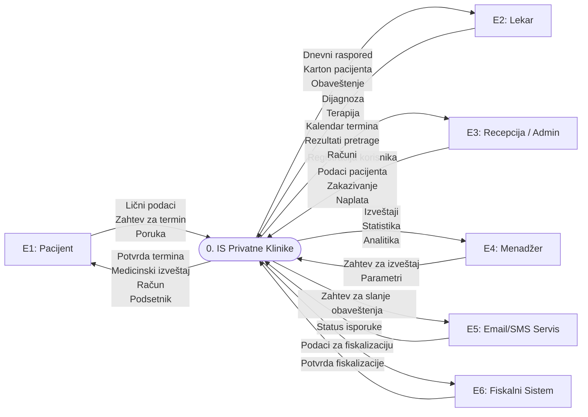
```mermaid
graph LR
    E1["E1: Pacijent"] -->|"Lični podaci<br/>Zahtev za termin<br/>Poruka"| P0(["0. IS Privatne Klinike"])
    P0 -->|"Potvrda termina<br/>Medicinski izveštaj<br/>Račun<br/>Podsetnik"| E1

    E2["E2: Lekar"] -->|"Nalaz<br/>Dijagnoza<br/>Terapija"| P0
    P0 -->|"Dnevni raspored<br/>Karton pacijenta<br/>Obaveštenje"| E2

    E3["E3: Recepcija / Admin"] -->|"Registracija korisnika<br/>Podaci pacijenta<br/>Zakazivanje<br/>Naplata"| P0
    P0 -->|"Kalendar termina<br/>Rezultati pretrage<br/>Računi"| E3

    E4["E4: Menadžer"] -->|"Zahtev za izveštaj<br/>Parametri"| P0
    P0 -->|"Izveštaji<br/>Statistika<br/>Analitika"| E4

    E5["E5: Email/SMS Servis"] -->|"Status isporuke"| P0
    P0 -->|"Zahtev za slanje obaveštenja"| E5

    E6["E6: Fiskalni Sistem"] -->|"Potvrda fiskalizacije"| P0
    P0 -->|"Podaci za fiskalizaciju"| E6
```

---

### 2.3 DFD Nivo 1 — Dekompozicija sistema

Sistem se dekomponuje na 10 glavnih procesa. Radi čitljivosti, dijagram je podeljen na tri tematske celine.

> **Legenda:** Pune strelice (`-->`) označavaju primarne tokove. Isprekidane strelice (`-.->`) označavaju sekundarne (čitanje) tokove ka skladištima.

#### Deo A: Administracija, korisnici i resursi (P1, P2, P3, P9)

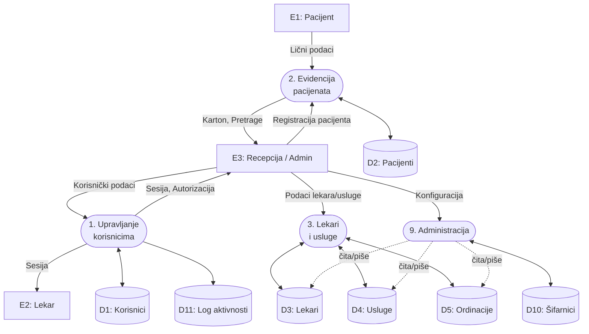
```mermaid
graph TD
    E1["E1: Pacijent"]
    E2["E2: Lekar"]
    E3["E3: Recepcija / Admin"]

    P1(["1. Upravljanje<br/>korisnicima"])
    P2(["2. Evidencija<br/>pacijenata"])
    P3(["3. Lekari<br/>i usluge"])
    P9(["9. Administracija"])

    D1[("D1: Korisnici")]
    D2[("D2: Pacijenti")]
    D3[("D3: Lekari")]
    D4[("D4: Usluge")]
    D5[("D5: Ordinacije")]
    D10[("D10: Šifarnici")]
    D11[("D11: Log aktivnosti")]

    E3 -->|"Korisnički podaci"| P1
    P1 -->|"Sesija, Autorizacija"| E3
    P1 -->|"Sesija"| E2
    P1 <--> D1
    P1 --> D11

    E1 -->|"Lični podaci"| P2
    E3 -->|"Registracija pacijenta"| P2
    P2 -->|"Karton, Pretrage"| E3
    P2 <--> D2

    E3 -->|"Podaci lekara/usluge"| P3
    P3 <--> D3
    P3 <--> D4
    P3 <--> D5

    E3 -->|"Konfiguracija"| P9
    P9 <--> D10
    P9 -.->|"čita/piše"| D3
    P9 -.->|"čita/piše"| D4
    P9 -.->|"čita/piše"| D5
```

#### Deo B: Zakazivanje, obaveštenja i pregledi (P4, P5, P6)

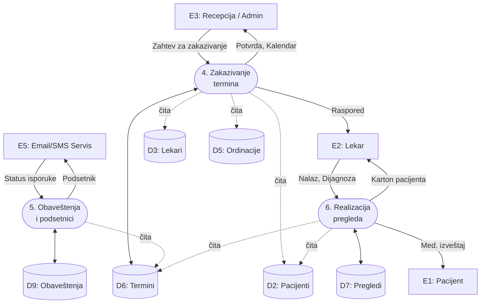
```mermaid
graph TD
    E1["E1: Pacijent"]
    E2["E2: Lekar"]
    E3["E3: Recepcija / Admin"]
    E5["E5: Email/SMS Servis"]

    P4(["4. Zakazivanje<br/>termina"])
    P5(["5. Obaveštenja<br/>i podsetnici"])
    P6(["6. Realizacija<br/>pregleda"])

    D2[("D2: Pacijenti")]
    D3[("D3: Lekari")]
    D5[("D5: Ordinacije")]
    D6[("D6: Termini")]
    D7[("D7: Pregledi")]
    D9[("D9: Obaveštenja")]

    E3 -->|"Zahtev za zakazivanje"| P4
    P4 -->|"Potvrda, Kalendar"| E3
    P4 -->|"Raspored"| E2
    P4 <--> D6
    P4 -.->|"čita"| D2
    P4 -.->|"čita"| D3
    P4 -.->|"čita"| D5

    P5 -->|"Podsetnik"| E5
    E5 -->|"Status isporuke"| P5
    P5 <--> D9
    P5 -.->|"čita"| D6

    E2 -->|"Nalaz, Dijagnoza"| P6
    P6 -->|"Karton pacijenta"| E2
    P6 -->|"Med. izveštaj"| E1
    P6 <--> D7
    P6 -.->|"čita"| D6
    P6 -.->|"čita"| D2
```

#### Deo C: Finansije, izveštaji i portal (P7, P8, P10)

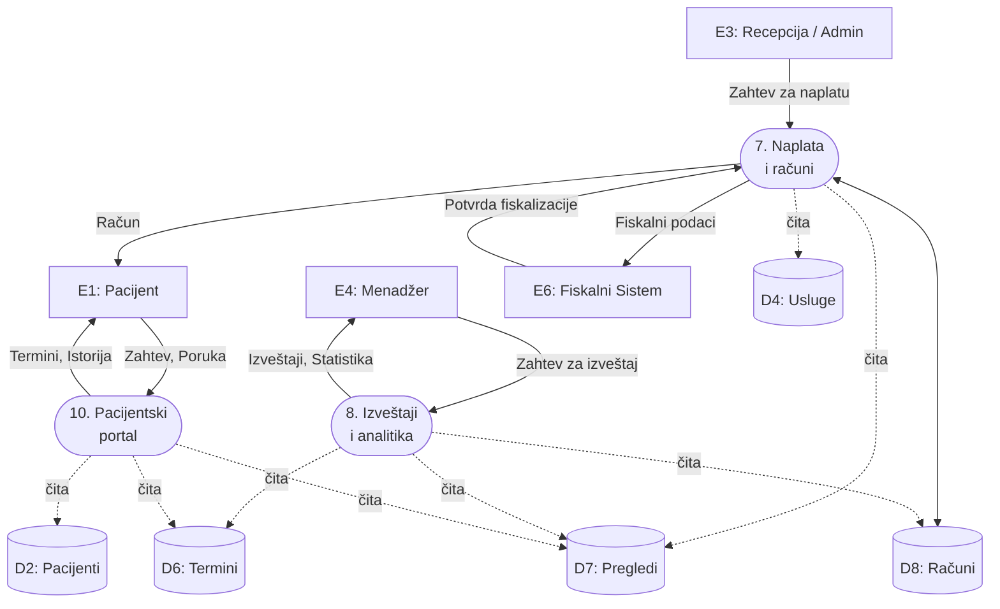
```mermaid
graph TD
    E1["E1: Pacijent"]
    E3["E3: Recepcija / Admin"]
    E4["E4: Menadžer"]
    E6["E6: Fiskalni Sistem"]

    P7(["7. Naplata<br/>i računi"])
    P8(["8. Izveštaji<br/>i analitika"])
    P10(["10. Pacijentski<br/>portal"])

    D2[("D2: Pacijenti")]
    D4[("D4: Usluge")]
    D6[("D6: Termini")]
    D7[("D7: Pregledi")]
    D8[("D8: Računi")]

    E3 -->|"Zahtev za naplatu"| P7
    P7 -->|"Račun"| E1
    P7 -->|"Fiskalni podaci"| E6
    E6 -->|"Potvrda fiskalizacije"| P7
    P7 <--> D8
    P7 -.->|"čita"| D7
    P7 -.->|"čita"| D4

    E4 -->|"Zahtev za izveštaj"| P8
    P8 -->|"Izveštaji, Statistika"| E4
    P8 -.->|"čita"| D6
    P8 -.->|"čita"| D7
    P8 -.->|"čita"| D8

    E1 -->|"Zahtev, Poruka"| P10
    P10 -->|"Termini, Istorija"| E1
    P10 -.->|"čita"| D2
    P10 -.->|"čita"| D6
    P10 -.->|"čita"| D7
```

---

### 2.4 DFD Nivo 2

#### 2.4.1 Proces 1: Upravljanje korisnicima i pristupom

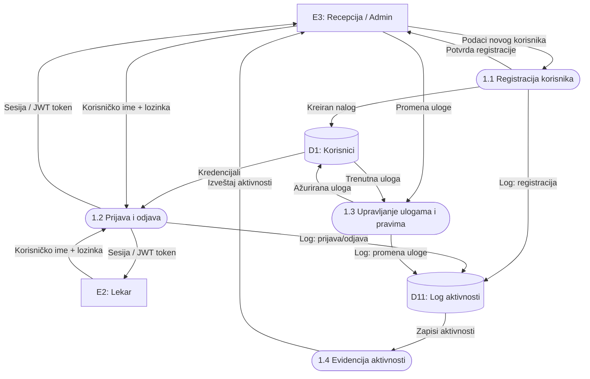
```mermaid
graph TD
    E3["E3: Recepcija / Admin"]
    E2["E2: Lekar"]

    P11(["1.1 Registracija korisnika"])
    P12(["1.2 Prijava i odjava"])
    P13(["1.3 Upravljanje ulogama i pravima"])
    P14(["1.4 Evidencija aktivnosti"])

    D1[("D1: Korisnici")]
    D11[("D11: Log aktivnosti")]

    E3 -->|"Podaci novog korisnika"| P11
    P11 -->|"Kreiran nalog"| D1
    P11 -->|"Potvrda registracije"| E3
    P11 -->|"Log: registracija"| D11

    D1 -->|"Kredencijali"| P12
    E3 -->|"Korisničko ime + lozinka"| P12
    E2 -->|"Korisničko ime + lozinka"| P12
    P12 -->|"Sesija / JWT token"| E3
    P12 -->|"Sesija / JWT token"| E2
    P12 -->|"Log: prijava/odjava"| D11

    E3 -->|"Promena uloge"| P13
    D1 -->|"Trenutna uloga"| P13
    P13 -->|"Ažurirana uloga"| D1
    P13 -->|"Log: promena uloge"| D11

    D11 -->|"Zapisi aktivnosti"| P14
    P14 -->|"Izveštaj aktivnosti"| E3
```

#### 2.4.2 Proces 2: Evidencija pacijenata

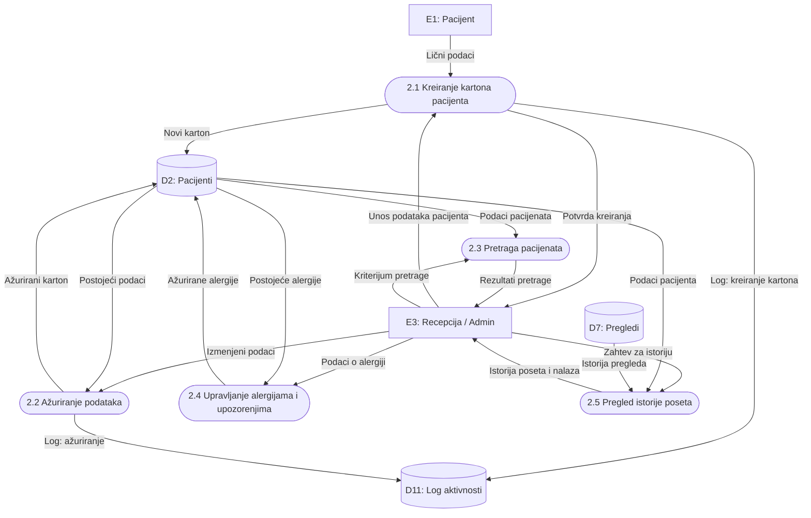
```mermaid
graph TD
    E1["E1: Pacijent"]
    E3["E3: Recepcija / Admin"]

    P21(["2.1 Kreiranje kartona pacijenta"])
    P22(["2.2 Ažuriranje podataka"])
    P23(["2.3 Pretraga pacijenata"])
    P24(["2.4 Upravljanje alergijama i upozorenjima"])
    P25(["2.5 Pregled istorije poseta"])

    D2[("D2: Pacijenti")]
    D7[("D7: Pregledi")]
    D11[("D11: Log aktivnosti")]

    E1 -->|"Lični podaci"| P21
    E3 -->|"Unos podataka pacijenta"| P21
    P21 -->|"Novi karton"| D2
    P21 -->|"Potvrda kreiranja"| E3
    P21 -->|"Log: kreiranje kartona"| D11

    E3 -->|"Izmenjeni podaci"| P22
    D2 -->|"Postojeći podaci"| P22
    P22 -->|"Ažurirani karton"| D2
    P22 -->|"Log: ažuriranje"| D11

    E3 -->|"Kriterijum pretrage"| P23
    D2 -->|"Podaci pacijenata"| P23
    P23 -->|"Rezultati pretrage"| E3

    E3 -->|"Podaci o alergiji"| P24
    D2 -->|"Postojeće alergije"| P24
    P24 -->|"Ažurirane alergije"| D2

    E3 -->|"Zahtev za istoriju"| P25
    D2 -->|"Podaci pacijenta"| P25
    D7 -->|"Istorija pregleda"| P25
    P25 -->|"Istorija poseta i nalaza"| E3
```

#### 2.4.3 Proces 3: Upravljanje lekarima i uslugama

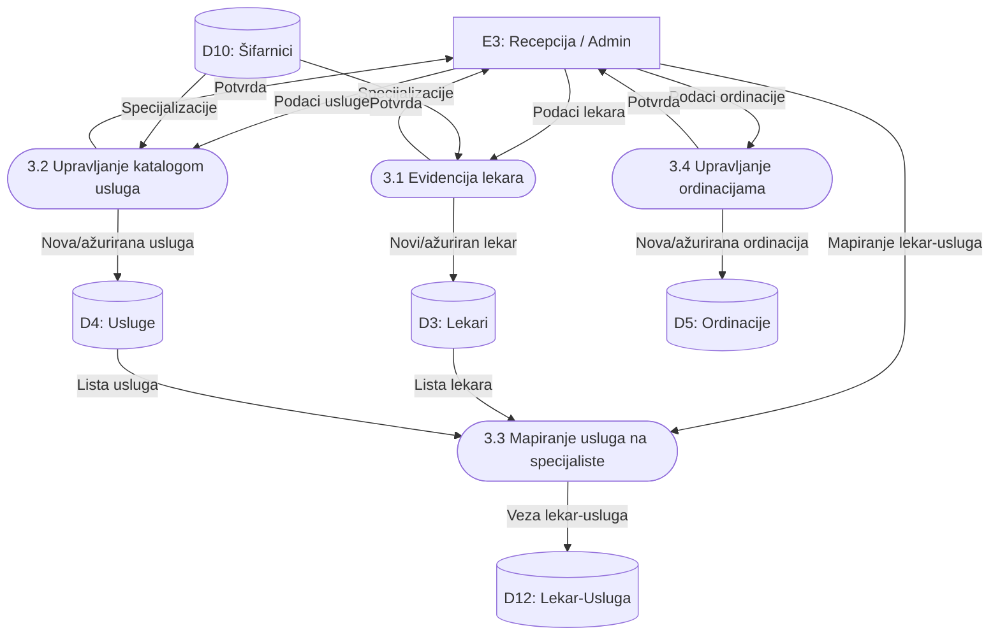
```mermaid
graph TD
    E3["E3: Recepcija / Admin"]

    P31(["3.1 Evidencija lekara"])
    P32(["3.2 Upravljanje katalogom usluga"])
    P33(["3.3 Mapiranje usluga na specijaliste"])
    P34(["3.4 Upravljanje ordinacijama"])

    D3[("D3: Lekari")]
    D4[("D4: Usluge")]
    D5[("D5: Ordinacije")]
    D10[("D10: Šifarnici")]
    D12[("D12: Lekar-Usluga")]

    E3 -->|"Podaci lekara"| P31
    D10 -->|"Specijalizacije"| P31
    P31 -->|"Novi/ažuriran lekar"| D3
    P31 -->|"Potvrda"| E3

    E3 -->|"Podaci usluge"| P32
    D10 -->|"Specijalizacije"| P32
    P32 -->|"Nova/ažurirana usluga"| D4
    P32 -->|"Potvrda"| E3

    E3 -->|"Mapiranje lekar-usluga"| P33
    D3 -->|"Lista lekara"| P33
    D4 -->|"Lista usluga"| P33
    P33 -->|"Veza lekar-usluga"| D12

    E3 -->|"Podaci ordinacije"| P34
    P34 -->|"Nova/ažurirana ordinacija"| D5
    P34 -->|"Potvrda"| E3
```

#### 2.4.4 Proces 4: Zakazivanje termina

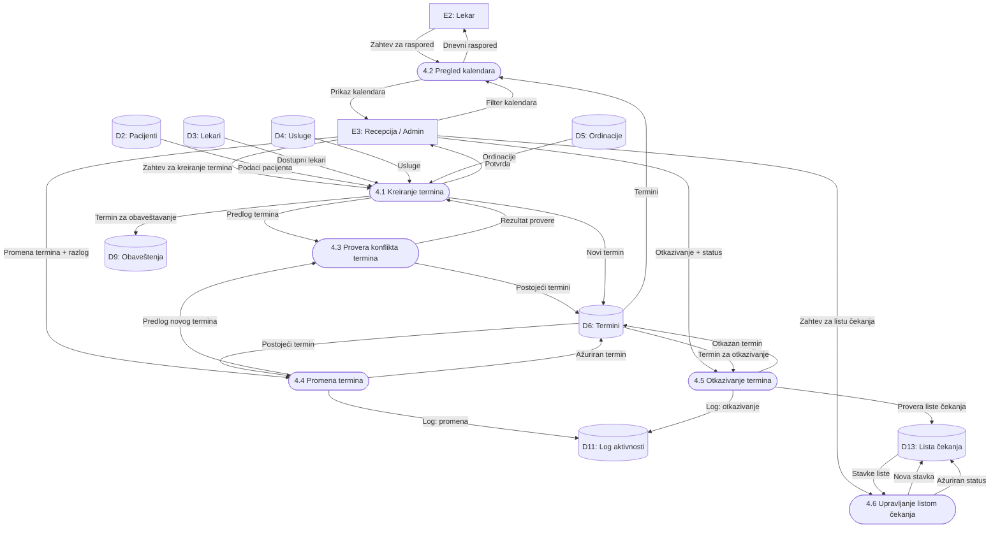
```mermaid
graph TD
    E2["E2: Lekar"]
    E3["E3: Recepcija / Admin"]

    P41(["4.1 Kreiranje termina"])
    P42(["4.2 Pregled kalendara"])
    P43(["4.3 Provera konflikta termina"])
    P44(["4.4 Promena termina"])
    P45(["4.5 Otkazivanje termina"])
    P46(["4.6 Upravljanje listom čekanja"])

    D2[("D2: Pacijenti")]
    D3[("D3: Lekari")]
    D4[("D4: Usluge")]
    D5[("D5: Ordinacije")]
    D6[("D6: Termini")]
    D9[("D9: Obaveštenja")]
    D11[("D11: Log aktivnosti")]
    D13[("D13: Lista čekanja")]

    E3 -->|"Zahtev za kreiranje termina"| P41
    D2 -->|"Podaci pacijenta"| P41
    D3 -->|"Dostupni lekari"| P41
    D4 -->|"Usluge"| P41
    D5 -->|"Ordinacije"| P41
    P41 -->|"Predlog termina"| P43
    P43 -->|"Postojeći termini"| D6
    P43 -->|"Rezultat provere"| P41
    P41 -->|"Novi termin"| D6
    P41 -->|"Potvrda"| E3
    P41 -->|"Termin za obaveštavanje"| D9

    E3 -->|"Filter kalendara"| P42
    E2 -->|"Zahtev za raspored"| P42
    D6 -->|"Termini"| P42
    P42 -->|"Prikaz kalendara"| E3
    P42 -->|"Dnevni raspored"| E2

    E3 -->|"Promena termina + razlog"| P44
    D6 -->|"Postojeći termin"| P44
    P44 -->|"Predlog novog termina"| P43
    P44 -->|"Ažuriran termin"| D6
    P44 -->|"Log: promena"| D11

    E3 -->|"Otkazivanje + status"| P45
    D6 -->|"Termin za otkazivanje"| P45
    P45 -->|"Otkazan termin"| D6
    P45 -->|"Provera liste čekanja"| D13
    P45 -->|"Log: otkazivanje"| D11

    E3 -->|"Zahtev za listu čekanja"| P46
    D13 -->|"Stavke liste"| P46
    P46 -->|"Nova stavka"| D13
    P46 -->|"Ažuriran status"| D13
```

#### 2.4.5 Proces 5: Obaveštenja i podsetnici

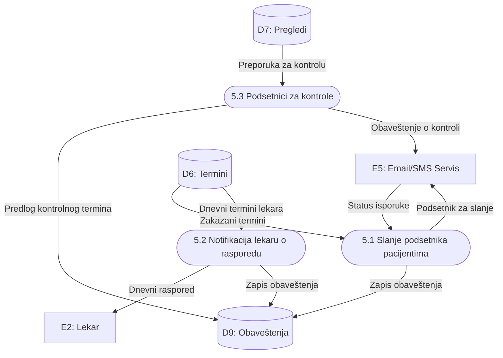
```mermaid
graph TD
    E2["E2: Lekar"]
    E5["E5: Email/SMS Servis"]

    P51(["5.1 Slanje podsetnika pacijentima"])
    P52(["5.2 Notifikacija lekaru o rasporedu"])
    P53(["5.3 Podsetnici za kontrole"])

    D6[("D6: Termini")]
    D7[("D7: Pregledi")]
    D9[("D9: Obaveštenja")]

    D6 -->|"Zakazani termini"| P51
    P51 -->|"Podsetnik za slanje"| E5
    E5 -->|"Status isporuke"| P51
    P51 -->|"Zapis obaveštenja"| D9

    D6 -->|"Dnevni termini lekara"| P52
    P52 -->|"Dnevni raspored"| E2
    P52 -->|"Zapis obaveštenja"| D9

    D7 -->|"Preporuka za kontrolu"| P53
    P53 -->|"Predlog kontrolnog termina"| D9
    P53 -->|"Obaveštenje o kontroli"| E5
```

#### 2.4.6 Proces 6: Realizacija pregleda i medicinska dokumentacija

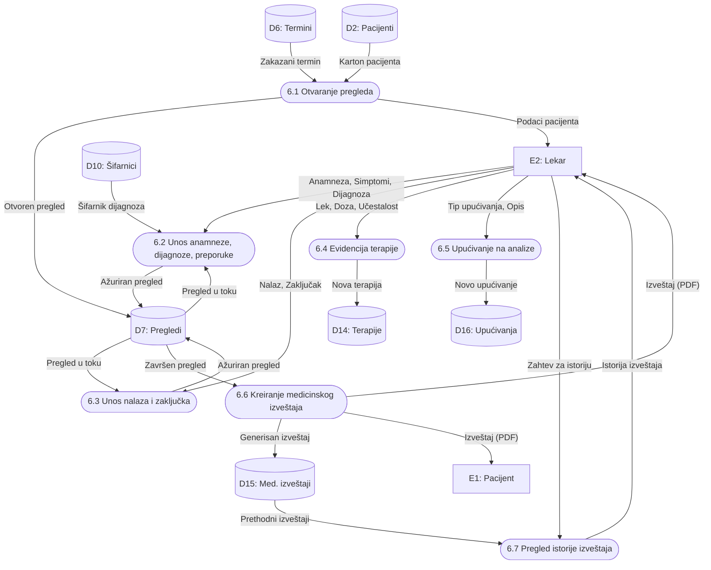
```mermaid
graph TD
    E2["E2: Lekar"]
    E1["E1: Pacijent"]

    P61(["6.1 Otvaranje pregleda"])
    P62(["6.2 Unos anamneze, dijagnoze, preporuke"])
    P63(["6.3 Unos nalaza i zaključka"])
    P64(["6.4 Evidencija terapije"])
    P65(["6.5 Upućivanje na analize"])
    P66(["6.6 Kreiranje medicinskog izveštaja"])
    P67(["6.7 Pregled istorije izveštaja"])

    D2[("D2: Pacijenti")]
    D6[("D6: Termini")]
    D7[("D7: Pregledi")]
    D10[("D10: Šifarnici")]
    D14[("D14: Terapije")]
    D15[("D15: Med. izveštaji")]
    D16[("D16: Upućivanja")]

    D6 -->|"Zakazani termin"| P61
    D2 -->|"Karton pacijenta"| P61
    P61 -->|"Otvoren pregled"| D7
    P61 -->|"Podaci pacijenta"| E2

    E2 -->|"Anamneza, Simptomi, Dijagnoza"| P62
    D10 -->|"Šifarnik dijagnoza"| P62
    D7 -->|"Pregled u toku"| P62
    P62 -->|"Ažuriran pregled"| D7

    E2 -->|"Nalaz, Zaključak"| P63
    D7 -->|"Pregled u toku"| P63
    P63 -->|"Ažuriran pregled"| D7

    E2 -->|"Lek, Doza, Učestalost"| P64
    P64 -->|"Nova terapija"| D14

    E2 -->|"Tip upućivanja, Opis"| P65
    P65 -->|"Novo upućivanje"| D16

    D7 -->|"Završen pregled"| P66
    P66 -->|"Generisan izveštaj"| D15
    P66 -->|"Izveštaj (PDF)"| E1
    P66 -->|"Izveštaj (PDF)"| E2

    E2 -->|"Zahtev za istoriju"| P67
    D15 -->|"Prethodni izveštaji"| P67
    P67 -->|"Istorija izveštaja"| E2
```

#### 2.4.7 Proces 7: Naplata i računi

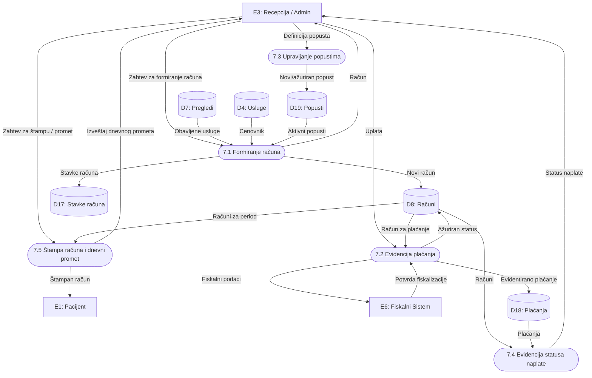
```mermaid
graph TD
    E1["E1: Pacijent"]
    E3["E3: Recepcija / Admin"]
    E6["E6: Fiskalni Sistem"]

    P71(["7.1 Formiranje računa"])
    P72(["7.2 Evidencija plaćanja"])
    P73(["7.3 Upravljanje popustima"])
    P74(["7.4 Evidencija statusa naplate"])
    P75(["7.5 Štampa računa i dnevni promet"])

    D4[("D4: Usluge")]
    D7[("D7: Pregledi")]
    D8[("D8: Računi")]
    D17[("D17: Stavke računa")]
    D18[("D18: Plaćanja")]
    D19[("D19: Popusti")]

    E3 -->|"Zahtev za formiranje računa"| P71
    D7 -->|"Obavljene usluge"| P71
    D4 -->|"Cenovnik"| P71
    D19 -->|"Aktivni popusti"| P71
    P71 -->|"Novi račun"| D8
    P71 -->|"Stavke računa"| D17
    P71 -->|"Račun"| E3

    E3 -->|"Uplata"| P72
    D8 -->|"Račun za plaćanje"| P72
    P72 -->|"Evidentirano plaćanje"| D18
    P72 -->|"Ažuriran status"| D8
    P72 -->|"Fiskalni podaci"| E6
    E6 -->|"Potvrda fiskalizacije"| P72

    E3 -->|"Definicija popusta"| P73
    P73 -->|"Novi/ažuriran popust"| D19

    D8 -->|"Računi"| P74
    D18 -->|"Plaćanja"| P74
    P74 -->|"Status naplate"| E3

    E3 -->|"Zahtev za štampu / promet"| P75
    D8 -->|"Računi za period"| P75
    P75 -->|"Štampan račun"| E1
    P75 -->|"Izveštaj dnevnog prometa"| E3
```

#### 2.4.8 Proces 8: Izveštaji i analitika


```mermaid
graph TD
    E4["E4: Menadžer"]

    P81(["8.1 Izveštaj o pregledima"])
    P82(["8.2 Izveštaj o prihodima"])
    P83(["8.3 Izveštaj o otkazivanjima"])
    P84(["8.4 Popunjenost ordinacija"])
    P85(["8.5 Statistika usluga"])

    D3[("D3: Lekari")]
    D4[("D4: Usluge")]
    D5[("D5: Ordinacije")]
    D6[("D6: Termini")]
    D7[("D7: Pregledi")]
    D8[("D8: Računi")]

    E4 -->|"Period, Filteri"| P81
    D7 -->|"Podaci o pregledima"| P81
    D3 -->|"Podaci o lekarima"| P81
    P81 -->|"Izveštaj o pregledima"| E4

    E4 -->|"Period"| P82
    D8 -->|"Podaci o računima"| P82
    D4 -->|"Podaci o uslugama"| P82
    P82 -->|"Izveštaj o prihodima"| E4

    E4 -->|"Period"| P83
    D6 -->|"Otkazani termini"| P83
    P83 -->|"Izveštaj o otkazivanjima"| E4

    E4 -->|"Period"| P84
    D6 -->|"Termini po ordinacijama"| P84
    D5 -->|"Podaci o ordinacijama"| P84
    D3 -->|"Podaci o lekarima"| P84
    P84 -->|"Izveštaj popunjenosti"| E4

    E4 -->|"Period"| P85
    D7 -->|"Pregledi po uslugama"| P85
    D4 -->|"Katalog usluga"| P85
    P85 -->|"Statistika usluga"| E4
```

#### 2.4.9 Proces 9: Administracija i šifarnici

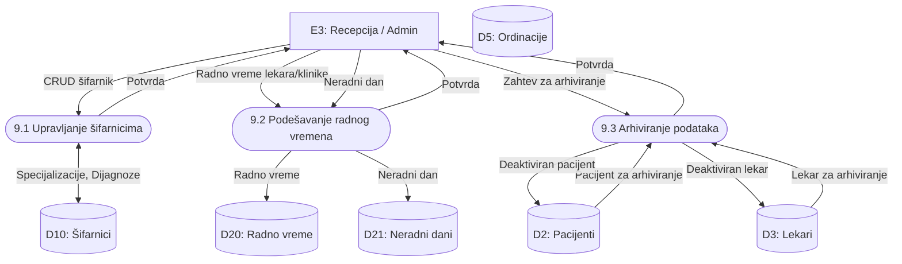
```mermaid
graph TD
    E3["E3: Recepcija / Admin"]

    P91(["9.1 Upravljanje šifarnicima"])
    P92(["9.2 Podešavanje radnog vremena"])
    P93(["9.3 Arhiviranje podataka"])

    D2[("D2: Pacijenti")]
    D3[("D3: Lekari")]
    D5[("D5: Ordinacije")]
    D10[("D10: Šifarnici")]
    D20[("D20: Radno vreme")]
    D21[("D21: Neradni dani")]

    E3 -->|"CRUD šifarnik"| P91
    P91 <-->|"Specijalizacije, Dijagnoze"| D10
    P91 -->|"Potvrda"| E3

    E3 -->|"Radno vreme lekara/klinike"| P92
    P92 -->|"Radno vreme"| D20
    E3 -->|"Neradni dan"| P92
    P92 -->|"Neradni dan"| D21
    P92 -->|"Potvrda"| E3

    E3 -->|"Zahtev za arhiviranje"| P93
    D2 -->|"Pacijent za arhiviranje"| P93
    P93 -->|"Deaktiviran pacijent"| D2
    D3 -->|"Lekar za arhiviranje"| P93
    P93 -->|"Deaktiviran lekar"| D3
    P93 -->|"Potvrda"| E3
```

#### 2.4.10 Proces 10: Pacijentski portal

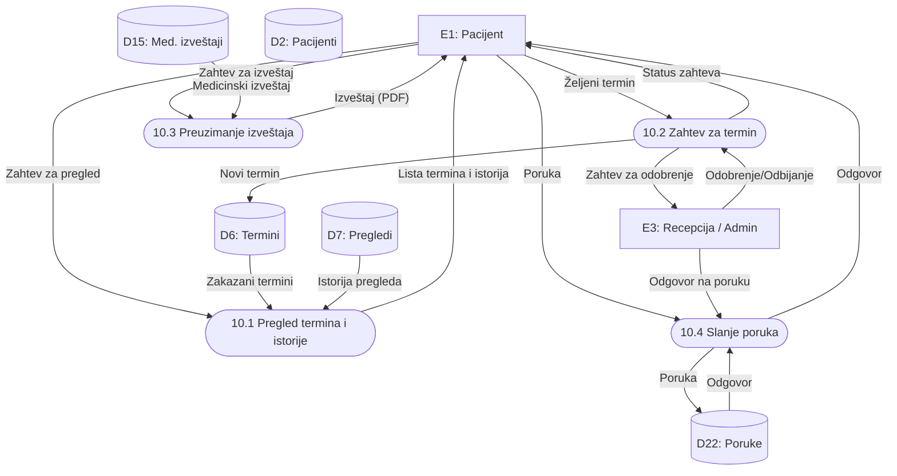
```mermaid
graph TD
    E1["E1: Pacijent"]
    E3["E3: Recepcija / Admin"]

    P101(["10.1 Pregled termina i istorije"])
    P102(["10.2 Zahtev za termin"])
    P103(["10.3 Preuzimanje izveštaja"])
    P104(["10.4 Slanje poruka"])

    D2[("D2: Pacijenti")]
    D6[("D6: Termini")]
    D7[("D7: Pregledi")]
    D15[("D15: Med. izveštaji")]
    D22[("D22: Poruke")]

    E1 -->|"Zahtev za pregled"| P101
    D6 -->|"Zakazani termini"| P101
    D7 -->|"Istorija pregleda"| P101
    P101 -->|"Lista termina i istorija"| E1

    E1 -->|"Željeni termin"| P102
    P102 -->|"Zahtev za odobrenje"| E3
    E3 -->|"Odobrenje/Odbijanje"| P102
    P102 -->|"Novi termin"| D6
    P102 -->|"Status zahteva"| E1

    E1 -->|"Zahtev za izveštaj"| P103
    D15 -->|"Medicinski izveštaj"| P103
    P103 -->|"Izveštaj (PDF)"| E1

    E1 -->|"Poruka"| P104
    P104 -->|"Poruka"| D22
    D22 -->|"Odgovor"| P104
    P104 -->|"Odgovor"| E1
    E3 -->|"Odgovor na poruku"| P104
```

---

### 2.5 DFD Nivo 3

#### 2.5.1 Proces 1.1: Registracija korisnika

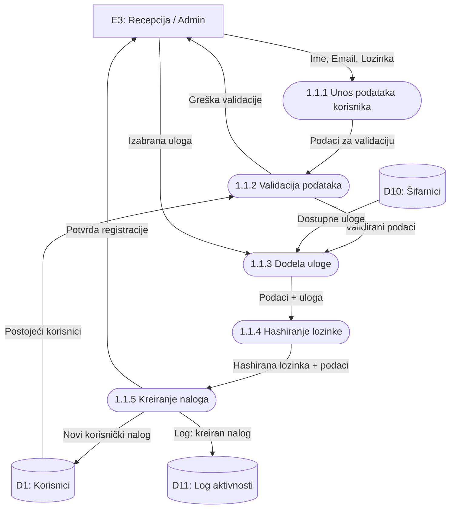
```mermaid
graph TD
    E3["E3: Recepcija / Admin"]
    D1[("D1: Korisnici")]
    D10[("D10: Šifarnici")]
    D11[("D11: Log aktivnosti")]

    P111(["1.1.1 Unos podataka korisnika"])
    P112(["1.1.2 Validacija podataka"])
    P113(["1.1.3 Dodela uloge"])
    P114(["1.1.4 Hashiranje lozinke"])
    P115(["1.1.5 Kreiranje naloga"])

    E3 -->|"Ime, Email, Lozinka"| P111
    P111 -->|"Podaci za validaciju"| P112
    D1 -->|"Postojeći korisnici"| P112
    P112 -->|"Validirani podaci"| P113
    P112 -->|"Greška validacije"| E3
    D10 -->|"Dostupne uloge"| P113
    E3 -->|"Izabrana uloga"| P113
    P113 -->|"Podaci + uloga"| P114
    P114 -->|"Hashirana lozinka + podaci"| P115
    P115 -->|"Novi korisnički nalog"| D1
    P115 -->|"Log: kreiran nalog"| D11
    P115 -->|"Potvrda registracije"| E3
```

#### 2.5.2 Proces 2.1: Kreiranje kartona pacijenta

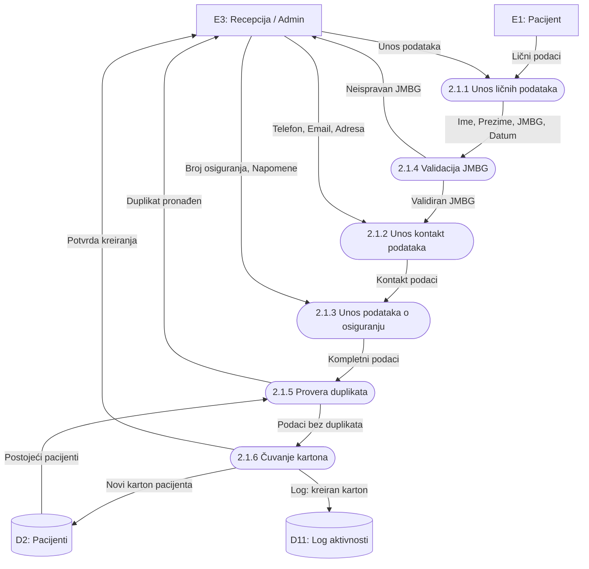
```mermaid
graph TD
    E3["E3: Recepcija / Admin"]
    E1["E1: Pacijent"]
    D2[("D2: Pacijenti")]
    D11[("D11: Log aktivnosti")]

    P211(["2.1.1 Unos ličnih podataka"])
    P212(["2.1.2 Unos kontakt podataka"])
    P213(["2.1.3 Unos podataka o osiguranju"])
    P214(["2.1.4 Validacija JMBG"])
    P215(["2.1.5 Provera duplikata"])
    P216(["2.1.6 Čuvanje kartona"])

    E1 -->|"Lični podaci"| P211
    E3 -->|"Unos podataka"| P211
    P211 -->|"Ime, Prezime, JMBG, Datum"| P214
    P214 -->|"Validiran JMBG"| P212
    P214 -->|"Neispravan JMBG"| E3
    E3 -->|"Telefon, Email, Adresa"| P212
    P212 -->|"Kontakt podaci"| P213
    E3 -->|"Broj osiguranja, Napomene"| P213
    P213 -->|"Kompletni podaci"| P215
    D2 -->|"Postojeći pacijenti"| P215
    P215 -->|"Duplikat pronađen"| E3
    P215 -->|"Podaci bez duplikata"| P216
    P216 -->|"Novi karton pacijenta"| D2
    P216 -->|"Log: kreiran karton"| D11
    P216 -->|"Potvrda kreiranja"| E3
```

#### 2.5.3 Proces 4.1: Kreiranje termina

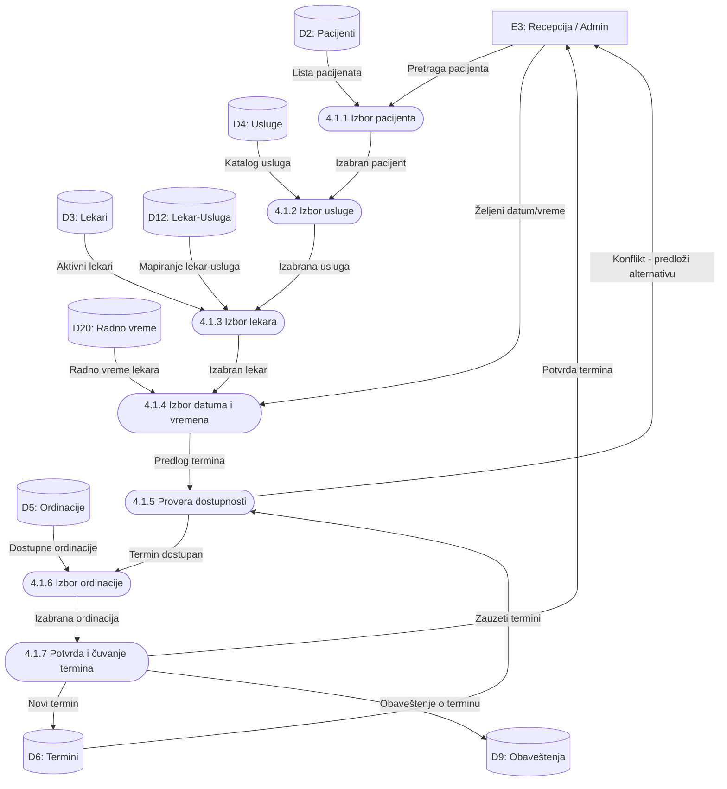
```mermaid
graph TD
    E3["E3: Recepcija / Admin"]
    D2[("D2: Pacijenti")]
    D3[("D3: Lekari")]
    D4[("D4: Usluge")]
    D5[("D5: Ordinacije")]
    D6[("D6: Termini")]
    D9[("D9: Obaveštenja")]
    D12[("D12: Lekar-Usluga")]
    D20[("D20: Radno vreme")]

    P411(["4.1.1 Izbor pacijenta"])
    P412(["4.1.2 Izbor usluge"])
    P413(["4.1.3 Izbor lekara"])
    P414(["4.1.4 Izbor datuma i vremena"])
    P415(["4.1.5 Provera dostupnosti"])
    P416(["4.1.6 Izbor ordinacije"])
    P417(["4.1.7 Potvrda i čuvanje termina"])

    E3 -->|"Pretraga pacijenta"| P411
    D2 -->|"Lista pacijenata"| P411
    P411 -->|"Izabran pacijent"| P412

    D4 -->|"Katalog usluga"| P412
    P412 -->|"Izabrana usluga"| P413

    D12 -->|"Mapiranje lekar-usluga"| P413
    D3 -->|"Aktivni lekari"| P413
    P413 -->|"Izabran lekar"| P414

    D20 -->|"Radno vreme lekara"| P414
    E3 -->|"Željeni datum/vreme"| P414
    P414 -->|"Predlog termina"| P415

    D6 -->|"Zauzeti termini"| P415
    P415 -->|"Termin dostupan"| P416
    P415 -->|"Konflikt - predloži alternativu"| E3

    D5 -->|"Dostupne ordinacije"| P416
    P416 -->|"Izabrana ordinacija"| P417

    P417 -->|"Novi termin"| D6
    P417 -->|"Obaveštenje o terminu"| D9
    P417 -->|"Potvrda termina"| E3
```

#### 2.5.4 Proces 6.2: Unos anamneze, dijagnoze i preporuke

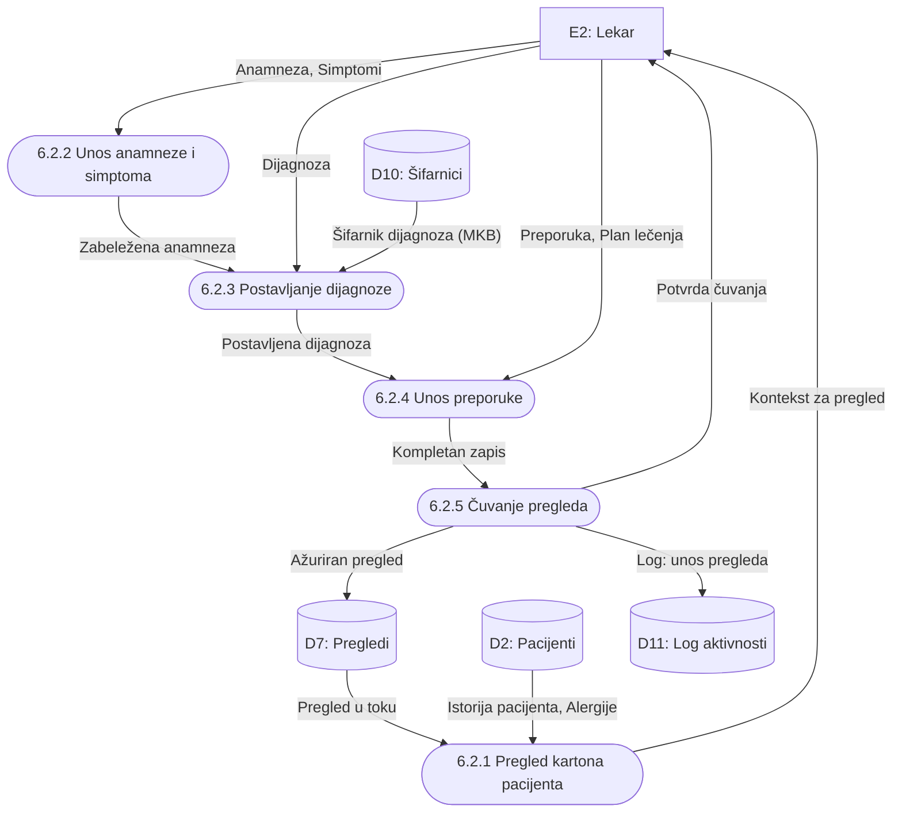
```mermaid
graph TD
    E2["E2: Lekar"]
    D2[("D2: Pacijenti")]
    D7[("D7: Pregledi")]
    D10[("D10: Šifarnici")]
    D11[("D11: Log aktivnosti")]

    P621(["6.2.1 Pregled kartona pacijenta"])
    P622(["6.2.2 Unos anamneze i simptoma"])
    P623(["6.2.3 Postavljanje dijagnoze"])
    P624(["6.2.4 Unos preporuke"])
    P625(["6.2.5 Čuvanje pregleda"])

    D7 -->|"Pregled u toku"| P621
    D2 -->|"Istorija pacijenta, Alergije"| P621
    P621 -->|"Kontekst za pregled"| E2

    E2 -->|"Anamneza, Simptomi"| P622
    P622 -->|"Zabeležena anamneza"| P623

    E2 -->|"Dijagnoza"| P623
    D10 -->|"Šifarnik dijagnoza (MKB)"| P623
    P623 -->|"Postavljena dijagnoza"| P624

    E2 -->|"Preporuka, Plan lečenja"| P624
    P624 -->|"Kompletan zapis"| P625

    P625 -->|"Ažuriran pregled"| D7
    P625 -->|"Log: unos pregleda"| D11
    P625 -->|"Potvrda čuvanja"| E2
```

#### 2.5.5 Proces 7.1: Formiranje računa

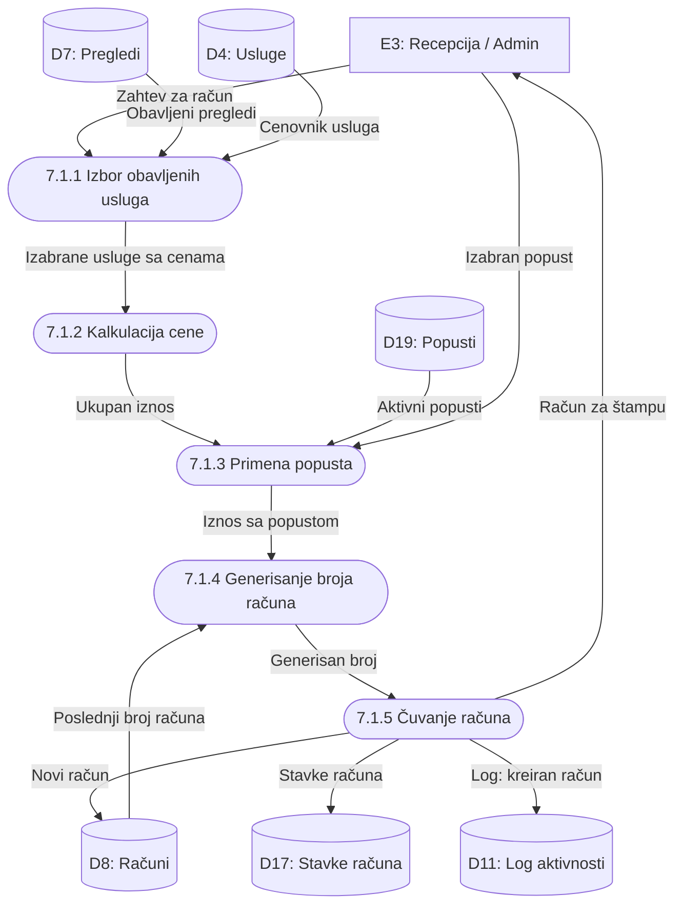
```mermaid
graph TD
    E3["E3: Recepcija / Admin"]
    D4[("D4: Usluge")]
    D7[("D7: Pregledi")]
    D8[("D8: Računi")]
    D17[("D17: Stavke računa")]
    D19[("D19: Popusti")]
    D11[("D11: Log aktivnosti")]

    P711(["7.1.1 Izbor obavljenih usluga"])
    P712(["7.1.2 Kalkulacija cene"])
    P713(["7.1.3 Primena popusta"])
    P714(["7.1.4 Generisanje broja računa"])
    P715(["7.1.5 Čuvanje računa"])

    E3 -->|"Zahtev za račun"| P711
    D7 -->|"Obavljeni pregledi"| P711
    D4 -->|"Cenovnik usluga"| P711
    P711 -->|"Izabrane usluge sa cenama"| P712

    P712 -->|"Ukupan iznos"| P713
    D19 -->|"Aktivni popusti"| P713
    E3 -->|"Izabran popust"| P713
    P713 -->|"Iznos sa popustom"| P714

    D8 -->|"Poslednji broj računa"| P714
    P714 -->|"Generisan broj"| P715

    P715 -->|"Novi račun"| D8
    P715 -->|"Stavke računa"| D17
    P715 -->|"Log: kreiran račun"| D11
    P715 -->|"Račun za štampu"| E3
```

---

## 3. Dijagram dekompozicije

Dijagram dekompozicije prikazuje hijerarhijsku strukturu sistema — od celokupnog sistema do najnižeg nivoa procesa. Radi čitljivosti, prikaz je podeljen po podsistemima.

### 3.1 Nivo 0 → Nivo 1: Glavni podsistemi

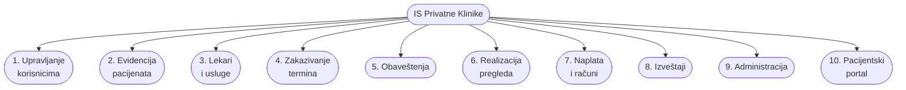
```mermaid
graph TD
    ROOT(["IS Privatne Klinike"])
    ROOT --> P1(["1. Upravljanje<br/>korisnicima"])
    ROOT --> P2(["2. Evidencija<br/>pacijenata"])
    ROOT --> P3(["3. Lekari<br/>i usluge"])
    ROOT --> P4(["4. Zakazivanje<br/>termina"])
    ROOT --> P5(["5. Obaveštenja"])
    ROOT --> P6(["6. Realizacija<br/>pregleda"])
    ROOT --> P7(["7. Naplata<br/>i računi"])
    ROOT --> P8(["8. Izveštaji"])
    ROOT --> P9(["9. Administracija"])
    ROOT --> P10(["10. Pacijentski<br/>portal"])
```

### 3.2 P1: Upravljanje korisnicima

```mermaid
graph TD
    P1(["1. Upravljanje korisnicima"])
    P1 --> P11(["1.1 Registracija korisnika"])
    P1 --> P12(["1.2 Prijava / Odjava"])
    P1 --> P13(["1.3 Upravljanje ulogama"])
    P1 --> P14(["1.4 Evidencija aktivnosti"])
    P11 --> P111(["1.1.1 Unos podataka"])
    P11 --> P112(["1.1.2 Validacija"])
    P11 --> P113(["1.1.3 Dodela uloge"])
    P11 --> P114(["1.1.4 Hashiranje lozinke"])
    P11 --> P115(["1.1.5 Kreiranje naloga"])
```

### 3.3 P2: Evidencija pacijenata

```mermaid
graph TD
    P2(["2. Evidencija pacijenata"])
    P2 --> P21(["2.1 Kreiranje kartona"])
    P2 --> P22(["2.2 Ažuriranje podataka"])
    P2 --> P23(["2.3 Pretraga pacijenata"])
    P2 --> P24(["2.4 Alergije i upozorenja"])
    P2 --> P25(["2.5 Istorija poseta"])
    P21 --> P211(["2.1.1 Unos ličnih podataka"])
    P21 --> P212(["2.1.2 Kontakt podaci"])
    P21 --> P213(["2.1.3 Podaci o osiguranju"])
    P21 --> P214(["2.1.4 Validacija JMBG"])
    P21 --> P215(["2.1.5 Provera duplikata"])
    P21 --> P216(["2.1.6 Čuvanje kartona"])
```

### 3.4 P3: Lekari i usluge

```mermaid
graph TD
    P3(["3. Lekari i usluge"])
    P3 --> P31(["3.1 Evidencija lekara"])
    P3 --> P32(["3.2 Katalog usluga"])
    P3 --> P33(["3.3 Mapiranje lekar-usluga"])
    P3 --> P34(["3.4 Upravljanje ordinacijama"])
```

### 3.5 P4: Zakazivanje termina

```mermaid
graph TD
    P4(["4. Zakazivanje termina"])
    P4 --> P41(["4.1 Kreiranje termina"])
    P4 --> P42(["4.2 Pregled kalendara"])
    P4 --> P43(["4.3 Provera konflikta"])
    P4 --> P44(["4.4 Promena termina"])
    P4 --> P45(["4.5 Otkazivanje termina"])
    P4 --> P46(["4.6 Lista čekanja"])
    P41 --> P411(["4.1.1 Izbor pacijenta"])
    P41 --> P412(["4.1.2 Izbor usluge"])
    P41 --> P413(["4.1.3 Izbor lekara"])
    P41 --> P414(["4.1.4 Izbor datuma/vremena"])
    P41 --> P415(["4.1.5 Provera dostupnosti"])
    P41 --> P416(["4.1.6 Izbor ordinacije"])
    P41 --> P417(["4.1.7 Potvrda termina"])
```

### 3.6 P5: Obaveštenja | P8: Izveštaji | P9: Administracija | P10: Portal

```mermaid
graph TD
    P5(["5. Obaveštenja"])
    P5 --> P51(["5.1 Podsetnici pacijentima"])
    P5 --> P52(["5.2 Raspored lekara"])
    P5 --> P53(["5.3 Podsetnici za kontrole"])

    P8(["8. Izveštaji"])
    P8 --> P81(["8.1 Pregledi po lekaru"])
    P8 --> P82(["8.2 Prihodi"])
    P8 --> P83(["8.3 Otkazivanja"])
    P8 --> P84(["8.4 Popunjenost"])
    P8 --> P85(["8.5 Statistika usluga"])

    P9(["9. Administracija"])
    P9 --> P91(["9.1 Šifarnici"])
    P9 --> P92(["9.2 Radno vreme"])
    P9 --> P93(["9.3 Arhiviranje"])

    P10(["10. Pacijentski portal"])
    P10 --> P101(["10.1 Termini i istorija"])
    P10 --> P102(["10.2 Zahtev za termin"])
    P10 --> P103(["10.3 Preuzimanje izveštaja"])
    P10 --> P104(["10.4 Poruke"])
```

### 3.7 P6: Realizacija pregleda

```mermaid
graph TD
    P6(["6. Realizacija pregleda"])
    P6 --> P61(["6.1 Otvaranje pregleda"])
    P6 --> P62(["6.2 Anamneza i dijagnoza"])
    P6 --> P63(["6.3 Nalaz i zaključak"])
    P6 --> P64(["6.4 Terapija"])
    P6 --> P65(["6.5 Upućivanje"])
    P6 --> P66(["6.6 Medicinski izveštaj"])
    P6 --> P67(["6.7 Istorija izveštaja"])
    P62 --> P621(["6.2.1 Pregled kartona"])
    P62 --> P622(["6.2.2 Unos anamneze"])
    P62 --> P623(["6.2.3 Dijagnoza"])
    P62 --> P624(["6.2.4 Preporuka"])
    P62 --> P625(["6.2.5 Čuvanje"])
```

### 3.8 P7: Naplata i računi

```mermaid
graph TD
    P7(["7. Naplata i računi"])
    P7 --> P71(["7.1 Formiranje računa"])
    P7 --> P72(["7.2 Evidencija plaćanja"])
    P7 --> P73(["7.3 Upravljanje popustima"])
    P7 --> P74(["7.4 Status naplate"])
    P7 --> P75(["7.5 Štampa i promet"])
    P71 --> P711(["7.1.1 Izbor usluga"])
    P71 --> P712(["7.1.2 Kalkulacija cene"])
    P71 --> P713(["7.1.3 Primena popusta"])
    P71 --> P714(["7.1.4 Broj računa"])
    P71 --> P715(["7.1.5 Čuvanje"])
```

---

## 4. Rečnik podataka

### 4.1 Spoljni entiteti

| Oznaka | Naziv | Opis |
|--------|-------|------|
| E1 | Pacijent | Osoba koja koristi medicinske usluge klinike. Izvor ličnih podataka, primalac izveštaja i računa. |
| E2 | Lekar | Medicinski stručnjak zaposlen u klinici. Unosi nalaze, dijagnoze, terapije. Prima raspored. |
| E3 | Recepcija / Admin | Administrativno osoblje. Registruje pacijente, zakazuje termine, naplaćuje usluge. |
| E4 | Menadžer | Rukovodilac klinike. Traži izveštaje i analize performansi. |
| E5 | Email/SMS Servis | Eksterni servis za slanje obaveštenja. Prima zahtev, vraća status isporuke. |
| E6 | Fiskalni Sistem | Eksterni sistem za fiskalizaciju. Prima podatke računa, vraća potvrdu. |

### 4.2 Skladišta podataka

| Oznaka | Naziv | Opis | Struktura |
|--------|-------|------|-----------|
| D1 | Korisnici | Korisnički nalozi sistema | {Korisnik} |
| D2 | Pacijenti | Kartoni pacijenata sa ličnim i med. podacima | {Pacijent + {Alergija}} |
| D3 | Lekari | Evidencija lekara sa specijalizacijama | {Lekar} |
| D4 | Usluge | Katalog medicinskih usluga | {Usluga} |
| D5 | Ordinacije | Ordinacije/kabineti klinike | {Ordinacija} |
| D6 | Termini | Zakazani, realizovani, otkazani termini | {Termin} |
| D7 | Pregledi | Medicinska dokumentacija pregleda | {Pregled} |
| D8 | Računi | Fakture za obavljene usluge | {Racun} |
| D9 | Obaveštenja | Poslata i planirana obaveštenja | {Obavestenje} |
| D10 | Šifarnici | Specijalizacije, dijagnoze i dr. šifarnici | {Specijalizacija} + {Dijagnoza} |
| D11 | Log aktivnosti | Revizijska staza svih aktivnosti | {LogAktivnosti} |
| D12 | Lekar-Usluga | Mapiranje koji lekar pruža koju uslugu | {LekarUsluga} |
| D13 | Lista čekanja | Pacijenti koji čekaju slobodan termin | {StavkaListeCekanja} |
| D14 | Terapije | Propisane terapije iz pregleda | {Terapija} |
| D15 | Med. izveštaji | Generisani medicinski izveštaji | {MedicinskiIzvestaj} |
| D16 | Upućivanja | Upućivanja na dodatne analize | {Upucivanje} |
| D17 | Stavke računa | Pojedinačne stavke na računu | {StavkaRacuna} |
| D18 | Plaćanja | Evidencija izvršenih plaćanja | {Placanje} |
| D19 | Popusti | Definisani popusti i akcije | {Popust} |
| D20 | Radno vreme | Radno vreme lekara i klinike | {RadnoVreme} |
| D21 | Neradni dani | Praznici i neradni dani klinike | {NeradniDan} |
| D22 | Poruke | Poruke između pacijenata i osoblja | {Poruka} |

### 4.3 Ključni tokovi podataka

| Tok podataka | Izvor | Odredište | Kompozicija |
|--------------|-------|-----------|-------------|
| Lični podaci pacijenta | E1 / E3 | P2.1 | Ime + Prezime + JMBG + DatumRodjenja + Pol + Adresa + Telefon + (Email) |
| Korisnički podaci | E3 | P1.1 | KorisnickoIme + Lozinka + Ime + Prezime + Email + Telefon + Uloga |
| Zahtev za termin | E3 | P4.1 | PacijentID + UslugaID + LekarID + ZeljeniDatumVreme |
| Potvrda termina | P4.1 | E3 | TerminID + DatumVreme + LekarIme + UslugaNaziv + OrdinacijaNaziv |
| Podaci lekara | E3 | P3.1 | Ime + Prezime + SpecijalizacijaID + Titula + LicencaBroj + Telefon + Email |
| Podaci usluge | E3 | P3.2 | Naziv + Opis + TrajanjeMinuta + Cena + SpecijalizacijaID |
| Nalaz pregleda | E2 | P6.2 | Anamneza + Simptomi + DijagnozaID + Zakljucak + Preporuka |
| Terapija | E2 | P6.4 | NazivLeka + Doza + Ucestalost + Trajanje + (Napomena) |
| Zahtev za naplatu | E3 | P7.1 | PacijentID + {UslugaID + Cena} + (PopustID) |
| Račun | P7.5 | E1 | BrojRacuna + DatumIzdavanja + {StavkaNaziv + Cena} + UkupanIznos + StatusNaplate |
| Raspored lekara | P4.2 | E2 | Datum + {DatumVreme + PacijentIme + UslugaNaziv + Ordinacija} |
| Zahtev za izveštaj | E4 | P8 | TipIzvestaja + DatumOd + DatumDo + (LekarID) + (UslugaID) |
| Izveštaj za menadžment | P8 | E4 | TipIzvestaja + Period + {StavkaIzvestaja} + Sumarno |
| Podsetnik pacijentu | P5.1 | E5 | PacijentKontakt + TerminDatumVreme + LekarIme + UslugaNaziv |
| Medicinski izveštaj | P6.6 | E1 | IzvestajID + DatumPregleda + LekarIme + Dijagnoza + Zakljucak + Terapija |
| Promena termina | E3 | P4.4 | TerminID + NoviDatumVreme + RazlogPromene |
| Otkazivanje termina | E3 | P4.5 | TerminID + StatusOtkazivanja + (Razlog) |
| Uplata | E3 | P7.2 | RacunID + Iznos + NacinPlacanja |
| Fiskalni podaci | P7.2 | E6 | BrojRacuna + UkupanIznos + PDV + NacinPlacanja |
| Status isporuke | E5 | P5 | ObavestenjeID + StatusSlanja + DatumIsporuke |
| Zahtev sa portala | E1 | P10.2 | PacijentID + ZeljenaUsluga + ZeljeniDatumVreme + (Napomena) |
| Poruka | E1 | P10.4 | PacijentID + PrimalacTip + Sadrzaj |

### 4.4 Strukture podataka

```
Korisnik = KorisnikID + KorisnickoIme + LozinkaHash + Ime + Prezime 
         + Email + Telefon + Uloga + Aktivan + DatumKreiranja

Pacijent = PacijentID + Ime + Prezime + JMBG + DatumRodjenja + Pol 
         + Adresa + Telefon + (Email) + (BrojOsiguranja) + (Napomene) 
         + DatumRegistracije + Aktivan

Alergija = AlergijaID + PacijentID + NazivAlergena + (Opis) 
         + Ozbiljnost[blaga | umerena | teška]

Lekar = LekarID + KorisnikID + SpecijalizacijaID + Titula + LicencaBroj 
      + Aktivan

Specijalizacija = SpecijalizacijaID + Naziv + (Opis)

Usluga = UslugaID + Naziv + (Opis) + TrajanjeMinuta + Cena 
       + SpecijalizacijaID + Aktivan

LekarUsluga = LekarID + UslugaID

Ordinacija = OrdinacijaID + Naziv + (Lokacija) + (Oprema) + Dostupna

Termin = TerminID + PacijentID + LekarID + UslugaID + OrdinacijaID 
       + DatumVreme + TrajanjeMinuta 
       + Status[zakazan | realizovan | otkazao_pacijent | otkazala_klinika | nije_se_pojavio] 
       + (RazlogPromene) + (RazlogOtkazivanja) + KreatorID + DatumKreiranja

StavkaListeCekanja = ListaCekanjaID + PacijentID + UslugaID + (LekarID) 
                   + DatumUpisa + Prioritet[nizak | srednji | visok] 
                   + Status[aktivan | zakazan | istekao] + (Napomena)

Pregled = PregledID + TerminID + LekarID + PacijentID + (Anamneza) 
        + (Simptomi) + (DijagnozaID) + (DijagnozaTekst) + (Zakljucak) 
        + (Preporuka) + DatumPregleda 
        + Status[u_toku | zavrsen | otkazan]

Terapija = TerapijaID + PregledID + NazivLeka + Doza + Ucestalost 
         + Trajanje + (Napomena)

Upucivanje = UpucivanjeID + PregledID 
           + Tip[laboratorija | specijalisticki | dijagnostika] 
           + Opis + Status[izdato | realizovano | otkazano]

MedicinskiIzvestaj = IzvestajID + PregledID + PacijentID + LekarID 
                   + Sadrzaj + DatumKreiranja 
                   + Status[kreiran | potpisan | arhiviran]

Racun = RacunID + PacijentID + BrojRacuna + DatumIzdavanja 
      + UkupanIznos + (PopustProcenat) + IznosZaNaplatu 
      + StatusNaplate[placeno | neplaceno | delimicno] + (Napomena)

StavkaRacuna = StavkaID + RacunID + UslugaID + (PregledID) 
             + JedinicnaCena + Kolicina + (PopustProcenat) + Iznos

Placanje = PlacanjeID + RacunID + Iznos 
         + NacinPlacanja[gotovina | kartica | virman] 
         + DatumPlacanja + (Napomena)

Popust = PopustID + Naziv + Procenat + (VaziOd) + (VaziDo) + Aktivan

Obavestenje = ObavestenjeID + Tip[podsetnik | raspored | kontrola | poruka] 
            + PrimalacTip[pacijent | lekar] + PrimalacID + Sadrzaj 
            + DatumSlanja + Status[ceka | poslato | isporuceno | greska] 
            + (TerminID)

LogAktivnosti = LogID + KorisnikID + Akcija[kreiranje | izmena | brisanje | prijava | odjava] 
              + Tabela + EntitetID + (StareVrednosti) + (NoveVrednosti) 
              + DatumVreme + (IPAdresa)

RadnoVreme = RadnoVremeID + (LekarID) + DanUNedelji[1..7] 
           + VremeOd + VremeDo

NeradniDan = NeradniDanID + Datum + Naziv + (Opis)

Poruka = PorukaID + PosiljalacTip + PosiljalacID + PrimalacTip 
       + PrimalacID + Sadrzaj + DatumSlanja + Procitana

Dijagnoza = DijagnozaID + Sifra + Naziv + (Opis)
```

---

## 5. EER Model

### 5.1 EER dijagram

Radi čitljivosti, EER dijagram je podeljen na tri tematske celine. Entiteti koji se pojavljuju u više dijagrama služe kao spojne tačke.

#### 5.1.1 Korisnici, lekari i resursi

```mermaid
erDiagram
    KORISNIK {
        int KorisnikID PK
        string KorisnickoIme UK
        string LozinkaHash
        string Ime
        string Prezime
        string Email UK
        string Telefon
        string Uloga
        boolean Aktivan
        datetime DatumKreiranja
    }

    LEKAR {
        int LekarID PK
        int KorisnikID FK
        int SpecijalizacijaID FK
        string Titula
        string LicencaBroj UK
        boolean Aktivan
    }

    SPECIJALIZACIJA {
        int SpecijalizacijaID PK
        string Naziv UK
        string Opis
    }

    USLUGA {
        int UslugaID PK
        string Naziv
        string Opis
        int TrajanjeMinuta
        decimal Cena
        int SpecijalizacijaID FK
        boolean Aktivan
    }

    LEKAR_USLUGA {
        int LekarID PK_FK
        int UslugaID PK_FK
    }

    ORDINACIJA {
        int OrdinacijaID PK
        string Naziv
        string Lokacija
        string Oprema
        boolean Dostupna
    }

    RADNO_VREME {
        int RadnoVremeID PK
        int LekarID FK
        int DanUNedelji
        time VremeOd
        time VremeDo
    }

    KORISNIK ||--o| LEKAR : "specijalizuje se kao"
    SPECIJALIZACIJA ||--o{ LEKAR : "specijalisti"
    SPECIJALIZACIJA ||--o{ USLUGA : "usluge specijalizacije"
    LEKAR ||--o{ LEKAR_USLUGA : "pruža"
    USLUGA ||--o{ LEKAR_USLUGA : "pruža se od"
    LEKAR ||--o{ RADNO_VREME : "radi"
    KORISNIK ||--o{ LOG_AKTIVNOSTI : "generiše log"
```

#### 5.1.2 Pacijenti, termini i pregledi

```mermaid
erDiagram
    PACIJENT {
        int PacijentID PK
        string Ime
        string Prezime
        string JMBG UK
        date DatumRodjenja
        string Pol
        string Adresa
        string Telefon
        string Email
        string BrojOsiguranja
        string Napomene
        datetime DatumRegistracije
        boolean Aktivan
    }

    ALERGIJA {
        int AlergijaID PK
        int PacijentID FK
        string NazivAlergena
        string Opis
        string Ozbiljnost
    }

    TERMIN {
        int TerminID PK
        int PacijentID FK
        int LekarID FK
        int UslugaID FK
        int OrdinacijaID FK
        datetime DatumVreme
        int TrajanjeMinuta
        string Status
        string RazlogPromene
        string RazlogOtkazivanja
        int KreatorID FK
        datetime DatumKreiranja
    }

    LISTA_CEKANJA {
        int ListaCekanjaID PK
        int PacijentID FK
        int UslugaID FK
        int LekarID FK
        datetime DatumUpisa
        int Prioritet
        string Status
        string Napomena
    }

    PREGLED {
        int PregledID PK
        int TerminID FK
        int LekarID FK
        int PacijentID FK
        text Anamneza
        text Simptomi
        int DijagnozaID FK
        text DijagnozaTekst
        text Zakljucak
        text Preporuka
        datetime DatumPregleda
        string Status
    }

    TERAPIJA {
        int TerapijaID PK
        int PregledID FK
        string NazivLeka
        string Doza
        string Ucestalost
        string Trajanje
        string Napomena
    }

    UPUCIVANJE {
        int UpucivanjeID PK
        int PregledID FK
        string Tip
        text Opis
        string Status
    }

    DIJAGNOZA {
        int DijagnozaID PK
        string Sifra UK
        string Naziv
        string Opis
    }

    MEDICINSKI_IZVESTAJ {
        int IzvestajID PK
        int PregledID FK
        int PacijentID FK
        int LekarID FK
        text Sadrzaj
        datetime DatumKreiranja
        string Status
    }

    PACIJENT ||--o{ ALERGIJA : "ima alergije"
    PACIJENT ||--o{ TERMIN : "zakazuje"
    PACIJENT ||--o{ PREGLED : "ima preglede"
    PACIJENT ||--o{ MEDICINSKI_IZVESTAJ : "ima izveštaje"
    PACIJENT ||--o{ LISTA_CEKANJA : "čeka u redu"
    TERMIN ||--o| PREGLED : "realizuje se kao"
    DIJAGNOZA ||--o{ PREGLED : "dijagnostikovan"
    PREGLED ||--o{ TERAPIJA : "propisuje terapiju"
    PREGLED ||--o{ UPUCIVANJE : "upućuje"
    PREGLED ||--o| MEDICINSKI_IZVESTAJ : "generiše izveštaj"
```

#### 5.1.3 Finansije, obaveštenja i sistem

```mermaid
erDiagram
    RACUN {
        int RacunID PK
        int PacijentID FK
        string BrojRacuna UK
        datetime DatumIzdavanja
        decimal UkupanIznos
        decimal PopustProcenat
        decimal IznosZaNaplatu
        string StatusNaplate
        string Napomena
    }

    STAVKA_RACUNA {
        int StavkaID PK
        int RacunID FK
        int UslugaID FK
        int PregledID FK
        decimal JedinicnaCena
        int Kolicina
        decimal PopustProcenat
        decimal Iznos
    }

    PLACANJE {
        int PlacanjeID PK
        int RacunID FK
        decimal Iznos
        string NacinPlacanja
        datetime DatumPlacanja
        string Napomena
    }

    POPUST {
        int PopustID PK
        string Naziv
        decimal Procenat
        date VaziOd
        date VaziDo
        boolean Aktivan
    }

    OBAVESTENJE {
        int ObavestenjeID PK
        string Tip
        string PrimalacTip
        int PrimalacID
        text Sadrzaj
        datetime DatumSlanja
        string Status
        int TerminID FK
    }

    LOG_AKTIVNOSTI {
        int LogID PK
        int KorisnikID FK
        string Akcija
        string Tabela
        int EntitetID
        text StareVrednosti
        text NoveVrednosti
        datetime DatumVreme
        string IPAdresa
    }

    NERADNI_DAN {
        int NeradniDanID PK
        date Datum
        string Naziv
        string Opis
    }

    PORUKA {
        int PorukaID PK
        string PosiljalacTip
        int PosiljalacID
        string PrimalacTip
        int PrimalacID
        text Sadrzaj
        datetime DatumSlanja
        boolean Procitana
    }

    RACUN ||--|{ STAVKA_RACUNA : "sadrži stavke"
    RACUN ||--o{ PLACANJE : "plaća se"
```

### 5.2 Specijalizacija / Generalizacija (ISA hijerarhija)

Entitet **KORISNIK** predstavlja generalizaciju sa parcijalnom, preklapajućom specijalizacijom na konkretne uloge. Uloga se određuje atributom `Uloga`, ali specifični podtip **LEKAR** ima sopstvenu tabelu sa dodatnim atributima.

```mermaid
graph TD
    K["KORISNIK<br/>(KorisnikID, KorisnickoIme,<br/>LozinkaHash, Ime, Prezime,<br/>Email, Telefon, Uloga, Aktivan)"]

    K -->|"ISA<br/>(parcijalna, preklapajuća)"| L
    K -->|"Uloga = admin"| A
    K -->|"Uloga = recepcija"| R
    K -->|"Uloga = menadzer"| M

    L["LEKAR<br/>(LekarID, KorisnikID FK,<br/>SpecijalizacijaID FK,<br/>Titula, LicencaBroj)"]
    A["ADMIN<br/>(nema dodatnih atributa —<br/>uloga se čuva u KORISNIK.Uloga)"]
    R["RECEPCIJA<br/>(nema dodatnih atributa —<br/>uloga se čuva u KORISNIK.Uloga)"]
    M["MENADŽER<br/>(nema dodatnih atributa —<br/>uloga se čuva u KORISNIK.Uloga)"]

    style K fill:#e1f5fe,stroke:#0288d1,stroke-width:2px
    style L fill:#fff9c4,stroke:#f9a825,stroke-width:2px
    style A fill:#f3e5f5,stroke:#7b1fa2
    style R fill:#f3e5f5,stroke:#7b1fa2
    style M fill:#f3e5f5,stroke:#7b1fa2
```

> **Napomena:** Samo podtip **LEKAR** ima zasebnu tabelu jer poseduje specifične atribute (specijalizacija, titula, licenca). Ostale uloge (`admin`, `recepcija`, `menadzer`) se razlikuju isključivo po pravima pristupa i čuvaju se kao vrednost atributa `Uloga` u tabeli `KORISNIK`.

### 5.3 Opis entiteta

| Entitet | Tip | Opis |
|---------|-----|------|
| KORISNIK | Jaki | Korisnički nalog za pristup sistemu. Generalizacija za sve uloge. |
| LEKAR | Jaki (podtip KORISNIK) | Medicinski stručnjak sa specifičnim atributima. Povezan sa KORISNIK (1:1). |
| SPECIJALIZACIJA | Jaki (šifarnik) | Medicinska specijalizacija (kardiologija, dermatologija, itd.) |
| PACIJENT | Jaki | Osoba koja prima medicinske usluge. Centralni entitet sistema. |
| ALERGIJA | Slabi (zavistan od PACIJENT) | Alergija pacijenta. Egzistencijalno zavisna od PACIJENT. |
| USLUGA | Jaki | Medicinska usluga koju klinika nudi. Deo kataloga usluga. |
| LEKAR_USLUGA | Asocijativni | Veza M:N između LEKAR i USLUGA. |
| ORDINACIJA | Jaki | Fizički prostor/kabinet u klinici. |
| TERMIN | Jaki | Zakazan medicinski termin. Povezuje PACIJENT, LEKAR, USLUGA, ORDINACIJA. |
| LISTA_CEKANJA | Jaki | Stavka na listi čekanja za slobodan termin. |
| PREGLED | Jaki | Realizovan medicinski pregled. Nastaje iz TERMIN (1:0..1). |
| TERAPIJA | Slabi (zavistan od PREGLED) | Propisana terapija. Egzistencijalno zavisna od PREGLED. |
| UPUCIVANJE | Slabi (zavistan od PREGLED) | Upućivanje na dodatne analize. Zavisna od PREGLED. |
| MEDICINSKI_IZVESTAJ | Jaki | Formalni medicinski izveštaj generisan iz pregleda. |
| RACUN | Jaki | Finansijski dokument za obavljene usluge. |
| STAVKA_RACUNA | Slabi (zavistan od RACUN) | Pojedinačna stavka na računu. Zavisna od RACUN. |
| PLACANJE | Jaki | Evidencija jednog plaćanja vezanog za račun. |
| POPUST | Jaki | Definicija popusta ili akcije. |
| OBAVESTENJE | Jaki | Obaveštenje/podsetnik poslat korisniku sistema. |
| LOG_AKTIVNOSTI | Jaki | Zapis revizijske staze (audit trail). |
| RADNO_VREME | Slabi (zavistan od LEKAR) | Radno vreme lekara po danu u nedelji. |
| NERADNI_DAN | Jaki | Klinički neradni dan (praznik, odmor). |
| DIJAGNOZA | Jaki (šifarnik) | Šifarnik dijagnoza (MKB-10 baziran). |
| PORUKA | Jaki | Interna poruka između korisnika sistema. |

### 5.4 Opis veza i kardinalnosti

| Veza | Entitet 1 | Kardinalnost | Entitet 2 | Opis |
|------|-----------|-------------|-----------|------|
| specijalizuje se kao | KORISNIK | 1:0..1 | LEKAR | Korisnik može biti lekar (ISA) |
| ima specijalizaciju | SPECIJALIZACIJA | 1:N | LEKAR | Svaki lekar ima jednu specijalizaciju |
| pruža usluge | LEKAR | M:N | USLUGA | Lekar može pružati više usluga, uslugu može pružati više lekara |
| ima alergije | PACIJENT | 1:N | ALERGIJA | Pacijent može imati 0 ili više alergija |
| zakazuje termin | PACIJENT | 1:N | TERMIN | Pacijent može imati više termina |
| obavlja termin | LEKAR | 1:N | TERMIN | Lekar obavlja više termina |
| tip pregleda | USLUGA | 1:N | TERMIN | Svaki termin je za jednu uslugu |
| lokacija | ORDINACIJA | 1:N | TERMIN | Svaki termin je u jednoj ordinaciji |
| realizuje se | TERMIN | 1:0..1 | PREGLED | Termin se realizuje kao najviše jedan pregled |
| propisuje terapiju | PREGLED | 1:N | TERAPIJA | Pregled može imati više terapija |
| upućuje | PREGLED | 1:N | UPUCIVANJE | Pregled može imati više upućivanja |
| generiše izveštaj | PREGLED | 1:0..1 | MED_IZVESTAJ | Pregled može imati jedan izveštaj |
| dijagnostikovan | DIJAGNOZA | 1:N | PREGLED | Dijagnoza se koristi u više pregleda |
| sadrži stavke | RACUN | 1:N | STAVKA_RACUNA | Račun ima jednu ili više stavki |
| plaća se | RACUN | 1:N | PLACANJE | Račun može imati više plaćanja |
| kreirao termin | KORISNIK | 1:N | TERMIN | Korisnik koji je kreirao termin |
| generiše log | KORISNIK | 1:N | LOG_AKTIVNOSTI | Korisnik generiše log zapise |
| podsetnik za | TERMIN | 1:N | OBAVESTENJE | Termin može imati više obaveštenja |
| radi | LEKAR | 1:N | RADNO_VREME | Lekar ima radno vreme za svaki dan |

---

## 6. Relacioni Model

### 6.1 Dijagram relacionog modela

Radi čitljivosti, relacioni model je podeljen na tri tematske celine.

#### 6.1.1 Korisnici, lekari i resursi

```mermaid
erDiagram
    KORISNIK ||--o| LEKAR : "ISA"
    SPECIJALIZACIJA ||--o{ LEKAR : "ima"
    SPECIJALIZACIJA ||--o{ USLUGA : "pripada"
    LEKAR ||--o{ LEKAR_USLUGA : "pruza"
    USLUGA ||--o{ LEKAR_USLUGA : "od"
    LEKAR ||--o{ RADNO_VREME : "radi"

    KORISNIK {
        INT KorisnikID PK
        NVARCHAR50 KorisnickoIme UK
        NVARCHAR256 LozinkaHash
        NVARCHAR50 Ime
        NVARCHAR50 Prezime
        NVARCHAR100 Email UK
        NVARCHAR20 Telefon
        NVARCHAR20 Uloga
        BIT Aktivan
        DATETIME DatumKreiranja
    }

    LEKAR {
        INT LekarID PK
        INT KorisnikID FK_UK
        INT SpecijalizacijaID FK
        NVARCHAR20 Titula
        NVARCHAR30 LicencaBroj UK
        BIT Aktivan
    }

    SPECIJALIZACIJA {
        INT SpecijalizacijaID PK
        NVARCHAR100 Naziv UK
        NVARCHAR500 Opis
    }

    USLUGA {
        INT UslugaID PK
        NVARCHAR100 Naziv
        NVARCHAR500 Opis
        INT TrajanjeMinuta
        DECIMAL Cena
        INT SpecijalizacijaID FK
        BIT Aktivan
    }

    LEKAR_USLUGA {
        INT LekarID PK_FK
        INT UslugaID PK_FK
    }

    ORDINACIJA {
        INT OrdinacijaID PK
        NVARCHAR100 Naziv
        NVARCHAR200 Lokacija
        NVARCHAR500 Oprema
        BIT Dostupna
    }

    RADNO_VREME {
        INT RadnoVremeID PK
        INT LekarID FK
        INT DanUNedelji
        TIME VremeOd
        TIME VremeDo
    }

    NERADNI_DAN {
        INT NeradniDanID PK
        DATE Datum UK
        NVARCHAR100 Naziv
        NVARCHAR500 Opis
    }
```

#### 6.1.2 Pacijenti, termini i pregledi

```mermaid
erDiagram
    PACIJENT ||--o{ ALERGIJA : "ima"
    PACIJENT ||--o{ TERMIN : "zakazuje"
    LEKAR ||--o{ TERMIN : "obavlja"
    USLUGA ||--o{ TERMIN : "tip"
    ORDINACIJA ||--o{ TERMIN : "lokacija"
    KORISNIK ||--o{ TERMIN : "kreirao"
    TERMIN ||--o| PREGLED : "realizuje"
    LEKAR ||--o{ PREGLED : "vodi"
    PACIJENT ||--o{ PREGLED : "pregledao"
    DIJAGNOZA ||--o{ PREGLED : "dijagnoza"
    PREGLED ||--o{ TERAPIJA : "propisuje"
    PREGLED ||--o{ UPUCIVANJE : "upucuje"
    PREGLED ||--o| MEDICINSKI_IZVESTAJ : "izvestaj"
    PACIJENT ||--o{ MEDICINSKI_IZVESTAJ : "za"
    LEKAR ||--o{ MEDICINSKI_IZVESTAJ : "napisao"
    PACIJENT ||--o{ LISTA_CEKANJA : "ceka"
    USLUGA ||--o{ LISTA_CEKANJA : "za"

    PACIJENT {
        INT PacijentID PK
        NVARCHAR50 Ime
        NVARCHAR50 Prezime
        NCHAR13 JMBG UK
        DATE DatumRodjenja
        NCHAR1 Pol
        NVARCHAR200 Adresa
        NVARCHAR20 Telefon
        NVARCHAR100 Email
        NVARCHAR50 BrojOsiguranja
        NVARCHAR500 Napomene
        DATETIME DatumRegistracije
        BIT Aktivan
    }

    ALERGIJA {
        INT AlergijaID PK
        INT PacijentID FK
        NVARCHAR100 NazivAlergena
        NVARCHAR500 Opis
        NVARCHAR20 Ozbiljnost
    }

    TERMIN {
        INT TerminID PK
        INT PacijentID FK
        INT LekarID FK
        INT UslugaID FK
        INT OrdinacijaID FK
        DATETIME DatumVreme
        INT TrajanjeMinuta
        NVARCHAR30 Status
        NVARCHAR500 RazlogPromene
        NVARCHAR500 RazlogOtkazivanja
        INT KreatorID FK
        DATETIME DatumKreiranja
    }

    LISTA_CEKANJA {
        INT ListaCekanjaID PK
        INT PacijentID FK
        INT UslugaID FK
        INT LekarID FK
        DATETIME DatumUpisa
        INT Prioritet
        NVARCHAR20 Status
        NVARCHAR500 Napomena
    }

    PREGLED {
        INT PregledID PK
        INT TerminID FK_UK
        INT LekarID FK
        INT PacijentID FK
        NVARCHARMAX Anamneza
        NVARCHARMAX Simptomi
        INT DijagnozaID FK
        NVARCHARMAX DijagnozaTekst
        NVARCHARMAX Zakljucak
        NVARCHARMAX Preporuka
        DATETIME DatumPregleda
        NVARCHAR20 Status
    }

    TERAPIJA {
        INT TerapijaID PK
        INT PregledID FK
        NVARCHAR100 NazivLeka
        NVARCHAR50 Doza
        NVARCHAR50 Ucestalost
        NVARCHAR50 Trajanje
        NVARCHAR500 Napomena
    }

    UPUCIVANJE {
        INT UpucivanjeID PK
        INT PregledID FK
        NVARCHAR30 Tip
        NVARCHARMAX Opis
        NVARCHAR20 Status
    }

    DIJAGNOZA {
        INT DijagnozaID PK
        NVARCHAR20 Sifra UK
        NVARCHAR200 Naziv
        NVARCHAR500 Opis
    }

    MEDICINSKI_IZVESTAJ {
        INT IzvestajID PK
        INT PregledID FK
        INT PacijentID FK
        INT LekarID FK
        NVARCHARMAX Sadrzaj
        DATETIME DatumKreiranja
        NVARCHAR20 Status
    }
```

#### 6.1.3 Finansije, obaveštenja i sistem

```mermaid
erDiagram
    PACIJENT ||--o{ RACUN : "prima"
    RACUN ||--|{ STAVKA_RACUNA : "sadrzi"
    USLUGA ||--o{ STAVKA_RACUNA : "stavka"
    RACUN ||--o{ PLACANJE : "placa"
    TERMIN ||--o{ OBAVESTENJE : "za"
    KORISNIK ||--o{ LOG_AKTIVNOSTI : "log"

    RACUN {
        INT RacunID PK
        INT PacijentID FK
        NVARCHAR30 BrojRacuna UK
        DATETIME DatumIzdavanja
        DECIMAL UkupanIznos
        DECIMAL PopustProcenat
        DECIMAL IznosZaNaplatu
        NVARCHAR20 StatusNaplate
        NVARCHAR500 Napomena
    }

    STAVKA_RACUNA {
        INT StavkaID PK
        INT RacunID FK
        INT UslugaID FK
        INT PregledID FK
        DECIMAL JedinicnaCena
        INT Kolicina
        DECIMAL PopustProcenat
        DECIMAL Iznos
    }

    PLACANJE {
        INT PlacanjeID PK
        INT RacunID FK
        DECIMAL Iznos
        NVARCHAR20 NacinPlacanja
        DATETIME DatumPlacanja
        NVARCHAR500 Napomena
    }

    POPUST {
        INT PopustID PK
        NVARCHAR100 Naziv
        DECIMAL Procenat
        DATE VaziOd
        DATE VaziDo
        BIT Aktivan
    }

    OBAVESTENJE {
        INT ObavestenjeID PK
        NVARCHAR30 Tip
        NVARCHAR20 PrimalacTip
        INT PrimalacID
        NVARCHARMAX Sadrzaj
        DATETIME DatumSlanja
        NVARCHAR20 Status
        INT TerminID FK
    }

    LOG_AKTIVNOSTI {
        INT LogID PK
        INT KorisnikID FK
        NVARCHAR30 Akcija
        NVARCHAR100 Tabela
        INT EntitetID
        NVARCHARMAX StareVrednosti
        NVARCHARMAX NoveVrednosti
        DATETIME DatumVreme
        NVARCHAR45 IPAdresa
    }

    PORUKA {
        INT PorukaID PK
        NVARCHAR20 PosiljalacTip
        INT PosiljalacID
        NVARCHAR20 PrimalacTip
        INT PrimalacID
        NVARCHARMAX Sadrzaj
        DATETIME DatumSlanja
        BIT Procitana
    }
```

### 6.2 Definicije tabela

#### KORISNIK

| Kolona | Tip | Ograničenja | Opis |
|--------|-----|-------------|------|
| KorisnikID | INT | PK, IDENTITY(1,1) | Primarni ključ, auto-inkrement |
| KorisnickoIme | NVARCHAR(50) | NOT NULL, UNIQUE | Jedinstveno korisničko ime |
| LozinkaHash | NVARCHAR(256) | NOT NULL | Hashirana lozinka (bcrypt/Argon2) |
| Ime | NVARCHAR(50) | NOT NULL | Ime korisnika |
| Prezime | NVARCHAR(50) | NOT NULL | Prezime korisnika |
| Email | NVARCHAR(100) | NOT NULL, UNIQUE | Email adresa |
| Telefon | NVARCHAR(20) | NULL | Kontakt telefon |
| Uloga | NVARCHAR(20) | NOT NULL, CHECK(IN 'admin','recepcija','lekar','menadzer') | Uloga u sistemu |
| Aktivan | BIT | NOT NULL, DEFAULT 1 | Da li je nalog aktivan |
| DatumKreiranja | DATETIME | NOT NULL, DEFAULT GETDATE() | Datum kreiranja naloga |

#### LEKAR

| Kolona | Tip | Ograničenja | Opis |
|--------|-----|-------------|------|
| LekarID | INT | PK, IDENTITY(1,1) | Primarni ključ |
| KorisnikID | INT | FK → KORISNIK, NOT NULL, UNIQUE | Veza sa korisničkim nalogom (1:1) |
| SpecijalizacijaID | INT | FK → SPECIJALIZACIJA, NOT NULL | Medicinska specijalizacija |
| Titula | NVARCHAR(20) | NULL | Titula (dr, prof. dr, itd.) |
| LicencaBroj | NVARCHAR(30) | NOT NULL, UNIQUE | Broj lekarske licence |
| Aktivan | BIT | NOT NULL, DEFAULT 1 | Da li je lekar aktivan |

#### SPECIJALIZACIJA

| Kolona | Tip | Ograničenja | Opis |
|--------|-----|-------------|------|
| SpecijalizacijaID | INT | PK, IDENTITY(1,1) | Primarni ključ |
| Naziv | NVARCHAR(100) | NOT NULL, UNIQUE | Naziv specijalizacije |
| Opis | NVARCHAR(500) | NULL | Opis specijalizacije |

#### PACIJENT

| Kolona | Tip | Ograničenja | Opis |
|--------|-----|-------------|------|
| PacijentID | INT | PK, IDENTITY(1,1) | Primarni ključ |
| Ime | NVARCHAR(50) | NOT NULL | Ime pacijenta |
| Prezime | NVARCHAR(50) | NOT NULL | Prezime pacijenta |
| JMBG | NCHAR(13) | NOT NULL, UNIQUE | Jedinstveni matični broj |
| DatumRodjenja | DATE | NOT NULL | Datum rođenja |
| Pol | NCHAR(1) | NOT NULL, CHECK(IN 'M','Z') | Pol (M/Ž) |
| Adresa | NVARCHAR(200) | NULL | Adresa stanovanja |
| Telefon | NVARCHAR(20) | NOT NULL | Kontakt telefon |
| Email | NVARCHAR(100) | NULL | Email adresa |
| BrojOsiguranja | NVARCHAR(50) | NULL | Broj zdravstvenog osiguranja |
| Napomene | NVARCHAR(500) | NULL | Posebne napomene o pacijentu |
| DatumRegistracije | DATETIME | NOT NULL, DEFAULT GETDATE() | Datum registracije kartona |
| Aktivan | BIT | NOT NULL, DEFAULT 1 | Da li je karton aktivan |

#### ALERGIJA

| Kolona | Tip | Ograničenja | Opis |
|--------|-----|-------------|------|
| AlergijaID | INT | PK, IDENTITY(1,1) | Primarni ključ |
| PacijentID | INT | FK → PACIJENT, NOT NULL | Pacijent sa alergijom |
| NazivAlergena | NVARCHAR(100) | NOT NULL | Naziv alergena |
| Opis | NVARCHAR(500) | NULL | Dodatni opis reakcije |
| Ozbiljnost | NVARCHAR(20) | NOT NULL, CHECK(IN 'blaga','umerena','teska') | Stepen ozbiljnosti |

#### USLUGA

| Kolona | Tip | Ograničenja | Opis |
|--------|-----|-------------|------|
| UslugaID | INT | PK, IDENTITY(1,1) | Primarni ključ |
| Naziv | NVARCHAR(100) | NOT NULL | Naziv usluge |
| Opis | NVARCHAR(500) | NULL | Opis usluge |
| TrajanjeMinuta | INT | NOT NULL, CHECK(>0) | Trajanje u minutima |
| Cena | DECIMAL(10,2) | NOT NULL, CHECK(>=0) | Cena usluge |
| SpecijalizacijaID | INT | FK → SPECIJALIZACIJA, NOT NULL | Specijalizacija za uslugu |
| Aktivan | BIT | NOT NULL, DEFAULT 1 | Da li je usluga aktivna |

#### LEKAR_USLUGA

| Kolona | Tip | Ograničenja | Opis |
|--------|-----|-------------|------|
| LekarID | INT | PK, FK → LEKAR | Lekar koji pruža uslugu |
| UslugaID | INT | PK, FK → USLUGA | Usluga koju lekar pruža |

#### ORDINACIJA

| Kolona | Tip | Ograničenja | Opis |
|--------|-----|-------------|------|
| OrdinacijaID | INT | PK, IDENTITY(1,1) | Primarni ključ |
| Naziv | NVARCHAR(100) | NOT NULL | Naziv ordinacije/kabineta |
| Lokacija | NVARCHAR(200) | NULL | Opis lokacije (sprat, broj) |
| Oprema | NVARCHAR(500) | NULL | Opis dostupne opreme |
| Dostupna | BIT | NOT NULL, DEFAULT 1 | Da li je ordinacija dostupna |

#### TERMIN

| Kolona | Tip | Ograničenja | Opis |
|--------|-----|-------------|------|
| TerminID | INT | PK, IDENTITY(1,1) | Primarni ključ |
| PacijentID | INT | FK → PACIJENT, NOT NULL | Pacijent za koga je termin |
| LekarID | INT | FK → LEKAR, NOT NULL | Lekar koji obavlja pregled |
| UslugaID | INT | FK → USLUGA, NOT NULL | Vrsta usluge/pregleda |
| OrdinacijaID | INT | FK → ORDINACIJA, NOT NULL | Ordinacija u kojoj se obavlja |
| DatumVreme | DATETIME | NOT NULL | Datum i vreme termina |
| TrajanjeMinuta | INT | NOT NULL | Trajanje u minutima |
| Status | NVARCHAR(30) | NOT NULL, DEFAULT 'zakazan', CHECK(IN 'zakazan','realizovan','otkazao_pacijent','otkazala_klinika','nije_se_pojavio') | Status termina |
| RazlogPromene | NVARCHAR(500) | NULL | Razlog za promenu termina |
| RazlogOtkazivanja | NVARCHAR(500) | NULL | Razlog za otkazivanje |
| KreatorID | INT | FK → KORISNIK, NOT NULL | Ko je zakazao termin |
| DatumKreiranja | DATETIME | NOT NULL, DEFAULT GETDATE() | Kada je termin kreiran |

#### LISTA_CEKANJA

| Kolona | Tip | Ograničenja | Opis |
|--------|-----|-------------|------|
| ListaCekanjaID | INT | PK, IDENTITY(1,1) | Primarni ključ |
| PacijentID | INT | FK → PACIJENT, NOT NULL | Pacijent na listi čekanja |
| UslugaID | INT | FK → USLUGA, NOT NULL | Željena usluga |
| LekarID | INT | FK → LEKAR, NULL | Preferirani lekar (opciono) |
| DatumUpisa | DATETIME | NOT NULL, DEFAULT GETDATE() | Datum upisa na listu |
| Prioritet | INT | NOT NULL, DEFAULT 2, CHECK(IN 1,2,3) | 1=visok, 2=srednji, 3=nizak |
| Status | NVARCHAR(20) | NOT NULL, DEFAULT 'aktivan', CHECK(IN 'aktivan','zakazan','istekao') | Status stavke |
| Napomena | NVARCHAR(500) | NULL | Dodatna napomena |

#### PREGLED

| Kolona | Tip | Ograničenja | Opis |
|--------|-----|-------------|------|
| PregledID | INT | PK, IDENTITY(1,1) | Primarni ključ |
| TerminID | INT | FK → TERMIN, NOT NULL, UNIQUE | Termin iz koga proizilazi (1:1) |
| LekarID | INT | FK → LEKAR, NOT NULL | Lekar koji vodi pregled |
| PacijentID | INT | FK → PACIJENT, NOT NULL | Pacijent koji se pregleda |
| Anamneza | NVARCHAR(MAX) | NULL | Anamneza pacijenta |
| Simptomi | NVARCHAR(MAX) | NULL | Opisani simptomi |
| DijagnozaID | INT | FK → DIJAGNOZA, NULL | Šifra dijagnoze (MKB) |
| DijagnozaTekst | NVARCHAR(MAX) | NULL | Slobodan tekst dijagnoze |
| Zakljucak | NVARCHAR(MAX) | NULL | Zaključak pregleda |
| Preporuka | NVARCHAR(MAX) | NULL | Preporuke lekara |
| DatumPregleda | DATETIME | NOT NULL | Datum i vreme pregleda |
| Status | NVARCHAR(20) | NOT NULL, DEFAULT 'u_toku', CHECK(IN 'u_toku','zavrsen','otkazan') | Status pregleda |

#### TERAPIJA

| Kolona | Tip | Ograničenja | Opis |
|--------|-----|-------------|------|
| TerapijaID | INT | PK, IDENTITY(1,1) | Primarni ključ |
| PregledID | INT | FK → PREGLED, NOT NULL | Pregled u kome je propisana |
| NazivLeka | NVARCHAR(100) | NOT NULL | Naziv leka |
| Doza | NVARCHAR(50) | NOT NULL | Doza (npr. "500mg") |
| Ucestalost | NVARCHAR(50) | NOT NULL | Učestalost (npr. "3x dnevno") |
| Trajanje | NVARCHAR(50) | NOT NULL | Trajanje terapije (npr. "7 dana") |
| Napomena | NVARCHAR(500) | NULL | Dodatna napomena |

#### UPUCIVANJE

| Kolona | Tip | Ograničenja | Opis |
|--------|-----|-------------|------|
| UpucivanjeID | INT | PK, IDENTITY(1,1) | Primarni ključ |
| PregledID | INT | FK → PREGLED, NOT NULL | Pregled iz koga se upućuje |
| Tip | NVARCHAR(30) | NOT NULL, CHECK(IN 'laboratorija','specijalisticki','dijagnostika') | Tip upućivanja |
| Opis | NVARCHAR(MAX) | NOT NULL | Opis upućivanja |
| Status | NVARCHAR(20) | NOT NULL, DEFAULT 'izdato', CHECK(IN 'izdato','realizovano','otkazano') | Status upućivanja |

#### MEDICINSKI_IZVESTAJ

| Kolona | Tip | Ograničenja | Opis |
|--------|-----|-------------|------|
| IzvestajID | INT | PK, IDENTITY(1,1) | Primarni ključ |
| PregledID | INT | FK → PREGLED, NOT NULL | Pregled na osnovu koga se generiše |
| PacijentID | INT | FK → PACIJENT, NOT NULL | Pacijent za koga je izveštaj |
| LekarID | INT | FK → LEKAR, NOT NULL | Lekar koji je sačinio izveštaj |
| Sadrzaj | NVARCHAR(MAX) | NOT NULL | Tekst izveštaja |
| DatumKreiranja | DATETIME | NOT NULL, DEFAULT GETDATE() | Datum kreiranja |
| Status | NVARCHAR(20) | NOT NULL, DEFAULT 'kreiran', CHECK(IN 'kreiran','potpisan','arhiviran') | Status izveštaja |

#### RACUN

| Kolona | Tip | Ograničenja | Opis |
|--------|-----|-------------|------|
| RacunID | INT | PK, IDENTITY(1,1) | Primarni ključ |
| PacijentID | INT | FK → PACIJENT, NOT NULL | Pacijent na koga glasi račun |
| BrojRacuna | NVARCHAR(30) | NOT NULL, UNIQUE | Jedinstveni broj računa |
| DatumIzdavanja | DATETIME | NOT NULL, DEFAULT GETDATE() | Datum izdavanja |
| UkupanIznos | DECIMAL(12,2) | NOT NULL | Ukupan iznos pre popusta |
| PopustProcenat | DECIMAL(5,2) | NULL, DEFAULT 0 | Procenat popusta |
| IznosZaNaplatu | DECIMAL(12,2) | NOT NULL | Iznos za naplatu (posle popusta) |
| StatusNaplate | NVARCHAR(20) | NOT NULL, DEFAULT 'neplaceno', CHECK(IN 'placeno','neplaceno','delimicno') | Status naplate |
| Napomena | NVARCHAR(500) | NULL | Dodatna napomena |

#### STAVKA_RACUNA

| Kolona | Tip | Ograničenja | Opis |
|--------|-----|-------------|------|
| StavkaID | INT | PK, IDENTITY(1,1) | Primarni ključ |
| RacunID | INT | FK → RACUN, NOT NULL | Račun kome pripada stavka |
| UslugaID | INT | FK → USLUGA, NOT NULL | Fakturisana usluga |
| PregledID | INT | FK → PREGLED, NULL | Pregled vezan za stavku |
| JedinicnaCena | DECIMAL(10,2) | NOT NULL | Jedinična cena usluge |
| Kolicina | INT | NOT NULL, DEFAULT 1, CHECK(>0) | Količina |
| PopustProcenat | DECIMAL(5,2) | NULL, DEFAULT 0 | Popust na stavku |
| Iznos | DECIMAL(10,2) | NOT NULL | Izračunat iznos stavke |

#### PLACANJE

| Kolona | Tip | Ograničenja | Opis |
|--------|-----|-------------|------|
| PlacanjeID | INT | PK, IDENTITY(1,1) | Primarni ključ |
| RacunID | INT | FK → RACUN, NOT NULL | Račun koji se plaća |
| Iznos | DECIMAL(12,2) | NOT NULL, CHECK(>0) | Uplaćen iznos |
| NacinPlacanja | NVARCHAR(20) | NOT NULL, CHECK(IN 'gotovina','kartica','virman') | Način plaćanja |
| DatumPlacanja | DATETIME | NOT NULL, DEFAULT GETDATE() | Datum uplate |
| Napomena | NVARCHAR(500) | NULL | Napomena uz uplatu |

#### POPUST

| Kolona | Tip | Ograničenja | Opis |
|--------|-----|-------------|------|
| PopustID | INT | PK, IDENTITY(1,1) | Primarni ključ |
| Naziv | NVARCHAR(100) | NOT NULL | Naziv popusta/akcije |
| Procenat | DECIMAL(5,2) | NOT NULL, CHECK(BETWEEN 0 AND 100) | Procenat popusta |
| VaziOd | DATE | NULL | Datum početka važenja |
| VaziDo | DATE | NULL | Datum kraja važenja |
| Aktivan | BIT | NOT NULL, DEFAULT 1 | Da li je popust aktivan |

#### OBAVESTENJE

| Kolona | Tip | Ograničenja | Opis |
|--------|-----|-------------|------|
| ObavestenjeID | INT | PK, IDENTITY(1,1) | Primarni ključ |
| Tip | NVARCHAR(30) | NOT NULL, CHECK(IN 'podsetnik','raspored','kontrola','poruka') | Tip obaveštenja |
| PrimalacTip | NVARCHAR(20) | NOT NULL, CHECK(IN 'pacijent','lekar') | Tip primaoca |
| PrimalacID | INT | NOT NULL | ID primaoca (PacijentID ili LekarID) |
| Sadrzaj | NVARCHAR(MAX) | NOT NULL | Tekst obaveštenja |
| DatumSlanja | DATETIME | NOT NULL | Planirani/stvarni datum slanja |
| Status | NVARCHAR(20) | NOT NULL, DEFAULT 'ceka', CHECK(IN 'ceka','poslato','isporuceno','greska') | Status slanja |
| TerminID | INT | FK → TERMIN, NULL | Termin vezan za obaveštenje |

#### LOG_AKTIVNOSTI

| Kolona | Tip | Ograničenja | Opis |
|--------|-----|-------------|------|
| LogID | INT | PK, IDENTITY(1,1) | Primarni ključ |
| KorisnikID | INT | FK → KORISNIK, NOT NULL | Korisnik koji je izvršio akciju |
| Akcija | NVARCHAR(30) | NOT NULL | Tip akcije (kreiranje, izmena, brisanje, prijava, odjava) |
| Tabela | NVARCHAR(100) | NOT NULL | Naziv tabele nad kojom je akcija |
| EntitetID | INT | NULL | ID entiteta nad kojim je akcija |
| StareVrednosti | NVARCHAR(MAX) | NULL | JSON stare vrednosti (pre izmene) |
| NoveVrednosti | NVARCHAR(MAX) | NULL | JSON nove vrednosti (posle izmene) |
| DatumVreme | DATETIME | NOT NULL, DEFAULT GETDATE() | Datum i vreme akcije |
| IPAdresa | NVARCHAR(45) | NULL | IP adresa korisnika |

#### RADNO_VREME

| Kolona | Tip | Ograničenja | Opis |
|--------|-----|-------------|------|
| RadnoVremeID | INT | PK, IDENTITY(1,1) | Primarni ključ |
| LekarID | INT | FK → LEKAR, NULL | Lekar (NULL = globalno za kliniku) |
| DanUNedelji | INT | NOT NULL, CHECK(BETWEEN 1 AND 7) | Dan u nedelji (1=ponedeljak) |
| VremeOd | TIME | NOT NULL | Početak radnog vremena |
| VremeDo | TIME | NOT NULL | Kraj radnog vremena |

#### NERADNI_DAN

| Kolona | Tip | Ograničenja | Opis |
|--------|-----|-------------|------|
| NeradniDanID | INT | PK, IDENTITY(1,1) | Primarni ključ |
| Datum | DATE | NOT NULL, UNIQUE | Datum neradnog dana |
| Naziv | NVARCHAR(100) | NOT NULL | Naziv praznika/razlog |
| Opis | NVARCHAR(500) | NULL | Dodatni opis |

#### DIJAGNOZA

| Kolona | Tip | Ograničenja | Opis |
|--------|-----|-------------|------|
| DijagnozaID | INT | PK, IDENTITY(1,1) | Primarni ključ |
| Sifra | NVARCHAR(20) | NOT NULL, UNIQUE | Šifra dijagnoze (npr. MKB-10) |
| Naziv | NVARCHAR(200) | NOT NULL | Naziv dijagnoze |
| Opis | NVARCHAR(500) | NULL | Opis dijagnoze |

#### PORUKA

| Kolona | Tip | Ograničenja | Opis |
|--------|-----|-------------|------|
| PorukaID | INT | PK, IDENTITY(1,1) | Primarni ključ |
| PosiljalacTip | NVARCHAR(20) | NOT NULL, CHECK(IN 'pacijent','korisnik') | Tip pošiljaoca |
| PosiljalacID | INT | NOT NULL | ID pošiljaoca |
| PrimalacTip | NVARCHAR(20) | NOT NULL, CHECK(IN 'pacijent','korisnik') | Tip primaoca |
| PrimalacID | INT | NOT NULL | ID primaoca |
| Sadrzaj | NVARCHAR(MAX) | NOT NULL | Tekst poruke |
| DatumSlanja | DATETIME | NOT NULL, DEFAULT GETDATE() | Datum slanja |
| Procitana | BIT | NOT NULL, DEFAULT 0 | Da li je poruka pročitana |

### 6.3 Ograničenja referencijalnog integriteta

| Oznaka FK | Tabela | Kolona | Referira na | ON DELETE | ON UPDATE |
|-----------|--------|--------|-------------|-----------|-----------|
| FK_Lekar_Korisnik | LEKAR | KorisnikID | KORISNIK(KorisnikID) | CASCADE | CASCADE |
| FK_Lekar_Specijalizacija | LEKAR | SpecijalizacijaID | SPECIJALIZACIJA(SpecijalizacijaID) | RESTRICT | CASCADE |
| FK_Alergija_Pacijent | ALERGIJA | PacijentID | PACIJENT(PacijentID) | CASCADE | CASCADE |
| FK_Usluga_Specijalizacija | USLUGA | SpecijalizacijaID | SPECIJALIZACIJA(SpecijalizacijaID) | RESTRICT | CASCADE |
| FK_LekarUsluga_Lekar | LEKAR_USLUGA | LekarID | LEKAR(LekarID) | CASCADE | CASCADE |
| FK_LekarUsluga_Usluga | LEKAR_USLUGA | UslugaID | USLUGA(UslugaID) | CASCADE | CASCADE |
| FK_Termin_Pacijent | TERMIN | PacijentID | PACIJENT(PacijentID) | RESTRICT | CASCADE |
| FK_Termin_Lekar | TERMIN | LekarID | LEKAR(LekarID) | RESTRICT | CASCADE |
| FK_Termin_Usluga | TERMIN | UslugaID | USLUGA(UslugaID) | RESTRICT | CASCADE |
| FK_Termin_Ordinacija | TERMIN | OrdinacijaID | ORDINACIJA(OrdinacijaID) | RESTRICT | CASCADE |
| FK_Termin_Kreator | TERMIN | KreatorID | KORISNIK(KorisnikID) | RESTRICT | CASCADE |
| FK_ListaCekanja_Pacijent | LISTA_CEKANJA | PacijentID | PACIJENT(PacijentID) | CASCADE | CASCADE |
| FK_ListaCekanja_Usluga | LISTA_CEKANJA | UslugaID | USLUGA(UslugaID) | RESTRICT | CASCADE |
| FK_ListaCekanja_Lekar | LISTA_CEKANJA | LekarID | LEKAR(LekarID) | SET NULL | CASCADE |
| FK_Pregled_Termin | PREGLED | TerminID | TERMIN(TerminID) | RESTRICT | CASCADE |
| FK_Pregled_Lekar | PREGLED | LekarID | LEKAR(LekarID) | RESTRICT | CASCADE |
| FK_Pregled_Pacijent | PREGLED | PacijentID | PACIJENT(PacijentID) | RESTRICT | CASCADE |
| FK_Pregled_Dijagnoza | PREGLED | DijagnozaID | DIJAGNOZA(DijagnozaID) | SET NULL | CASCADE |
| FK_Terapija_Pregled | TERAPIJA | PregledID | PREGLED(PregledID) | CASCADE | CASCADE |
| FK_Upucivanje_Pregled | UPUCIVANJE | PregledID | PREGLED(PregledID) | CASCADE | CASCADE |
| FK_MedIzvestaj_Pregled | MEDICINSKI_IZVESTAJ | PregledID | PREGLED(PregledID) | RESTRICT | CASCADE |
| FK_MedIzvestaj_Pacijent | MEDICINSKI_IZVESTAJ | PacijentID | PACIJENT(PacijentID) | RESTRICT | CASCADE |
| FK_MedIzvestaj_Lekar | MEDICINSKI_IZVESTAJ | LekarID | LEKAR(LekarID) | RESTRICT | CASCADE |
| FK_Racun_Pacijent | RACUN | PacijentID | PACIJENT(PacijentID) | RESTRICT | CASCADE |
| FK_StavkaRacuna_Racun | STAVKA_RACUNA | RacunID | RACUN(RacunID) | CASCADE | CASCADE |
| FK_StavkaRacuna_Usluga | STAVKA_RACUNA | UslugaID | USLUGA(UslugaID) | RESTRICT | CASCADE |
| FK_StavkaRacuna_Pregled | STAVKA_RACUNA | PregledID | PREGLED(PregledID) | SET NULL | CASCADE |
| FK_Placanje_Racun | PLACANJE | RacunID | RACUN(RacunID) | RESTRICT | CASCADE |
| FK_Obavestenje_Termin | OBAVESTENJE | TerminID | TERMIN(TerminID) | SET NULL | CASCADE |
| FK_Log_Korisnik | LOG_AKTIVNOSTI | KorisnikID | KORISNIK(KorisnikID) | RESTRICT | CASCADE |
| FK_RadnoVreme_Lekar | RADNO_VREME | LekarID | LEKAR(LekarID) | CASCADE | CASCADE |

### 6.4 Indeksi

Za optimizaciju performansi, preporučuju se sledeći dodatni indeksi:

| Tabela | Kolona(e) | Tip | Obrazloženje |
|--------|-----------|-----|-------------|
| PACIJENT | Ime, Prezime | Non-clustered | Brza pretraga po imenu |
| PACIJENT | Telefon | Non-clustered | Pretraga po telefonu |
| PACIJENT | Email | Non-clustered | Pretraga po email-u |
| TERMIN | DatumVreme | Non-clustered | Pregled kalendara po datumu |
| TERMIN | LekarID, DatumVreme | Composite, Non-clustered | Raspored lekara i provera konflikta |
| TERMIN | OrdinacijaID, DatumVreme | Composite, Non-clustered | Provera dostupnosti ordinacije |
| TERMIN | Status | Non-clustered | Filtriranje po statusu |
| PREGLED | DatumPregleda | Non-clustered | Izveštaji po periodu |
| RACUN | DatumIzdavanja | Non-clustered | Izveštaji po periodu |
| RACUN | StatusNaplate | Non-clustered | Pregled neplaćenih računa |
| LOG_AKTIVNOSTI | DatumVreme | Non-clustered | Pregled logova po periodu |
| LOG_AKTIVNOSTI | KorisnikID, DatumVreme | Composite, Non-clustered | Logovi po korisniku |
| OBAVESTENJE | Status, DatumSlanja | Composite, Non-clustered | Obrada neobrađenih obaveštenja |

---

> **Dokument kreiran:** mart 2026.
> **Tehnologija:** Angular + ASP.NET Core + SQL Server
> **Verzija:** 1.0
